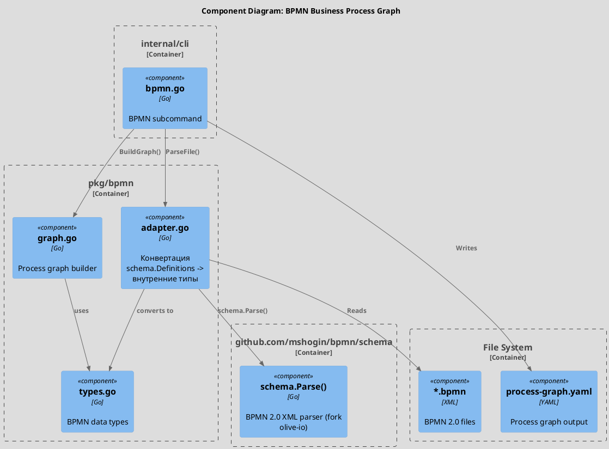
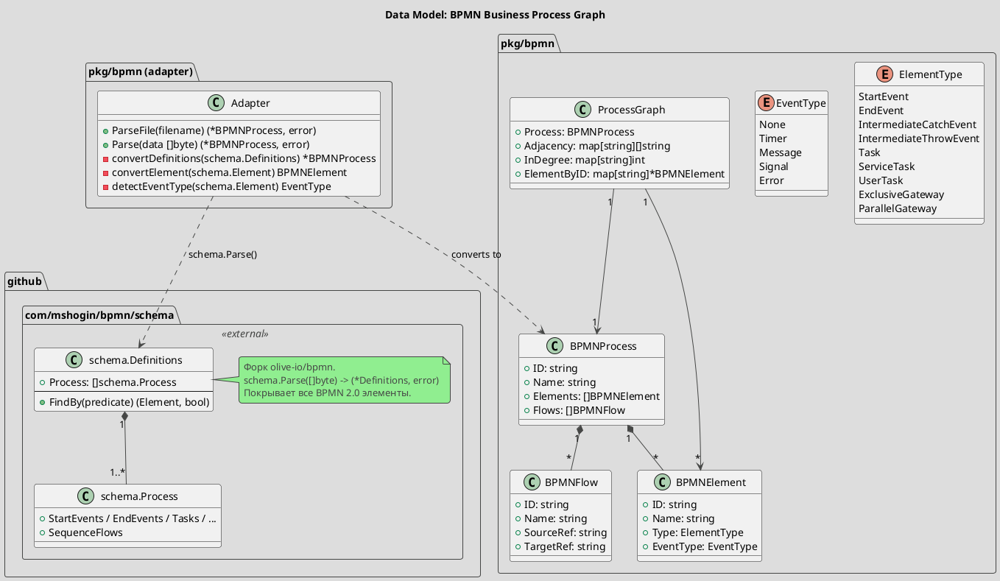
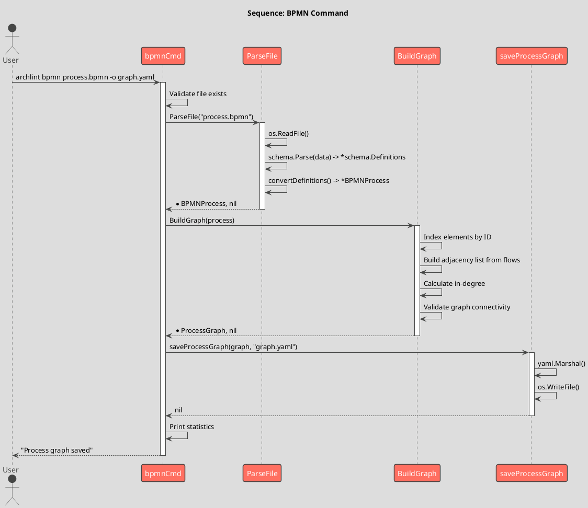

# Spec 0011: BPMN Business Process Graph

**Metadata:**
- Priority: 0011 (High)
- Status: Done
- Created: 2026-02-08
- Effort: M
- Parent Spec: -

---

## Overview

### Problem Statement

archlint строит два типа графов: структурный (из статического анализа кода) и поведенческий (из трассировок тестов). Текущий подход к поведенческому графу (трассировка через pkg/tracer) привязан к runtime и требует инструментации кода. Нет способа описать бизнес-процесс верхнего уровня - последовательность событий и задач, через которые проходит система.

Бизнес-процессы часто моделируются в BPMN 2.0 (Camunda, draw.io, Bizagi). Эти модели уже существуют в организациях, но не связаны с кодовой базой. archlint должен уметь парсить стандартные BPMN XML файлы и строить из них граф бизнес-процесса - "слой событий", верхний уровень двухуровневой поведенческой архитектуры.

### Solution Summary

Использовать форк BPMN-библиотеки `github.com/mshogin/bpmn/schema` (форк olive-io/bpmn) для парсинга BPMN 2.0 XML. В пакете `pkg/bpmn` реализовать адаптер, конвертирующий типы schema-библиотеки во внутренние типы archlint, построитель графа бизнес-процесса и CLI команду `bpmn`. Результат сохраняется в YAML формате, совместимом с концепциями architecture.yaml. Визуализация - в самом BPMN-редакторе (Camunda, draw.io), генерация дополнительных диаграмм не требуется.

### Success Metrics

- Парсинг BPMN файлов из Camunda Modeler и draw.io без ошибок
- Корректное построение графа для процессов с 5-50 элементами
- Время парсинга < 100ms для файлов до 1MB
- Покрытие тестами >= 80%

---

## Architecture

### Component Overview (C4 Component)



### Data Model



### Sequence Flow



---

## Requirements

### R1: BPMN 2.0 XML Parser (Adapter over mshogin/bpmn)

**Description:** Парсинг стандартных BPMN 2.0 XML файлов во внутренние типы через библиотеку `github.com/mshogin/bpmn/schema` (форк olive-io/bpmn). Adapter конвертирует типы schema-библиотеки в BPMNProcess/BPMNElement/BPMNFlow. Поддерживаются файлы из Camunda Modeler, draw.io, Bizagi.

**Внешняя зависимость:**

```
go get github.com/mshogin/bpmn/schema
```

Библиотека предоставляет:
- `schema.Parse([]byte) (*schema.Definitions, error)` - парсинг BPMN XML
- `schema.ExactId(string)` - поиск элементов по ID
- `schema.ElementType(Element)` - поиск по типу
- `element.FindBy(predicate)` - рекурсивный поиск
- Полное покрытие BPMN 2.0: events, tasks, gateways, flows, subprocesses

**API/Methods:**

```go
// Package: pkg/bpmn
// File: adapter.go

// ParseFile читает BPMN 2.0 XML файл и возвращает BPMNProcess.
// Внутри вызывает schema.Parse() и конвертирует результат.
func ParseFile(filename string) (*BPMNProcess, error)

// Parse парсит BPMN 2.0 XML из байтового среза.
func Parse(data []byte) (*BPMNProcess, error)

// Внутренние функции конвертации:
// convertDefinitions(*schema.Definitions) -> *BPMNProcess
// convertProcess(schema.Process) -> *BPMNProcess
// convertElement(schema.Element, ElementType) -> BPMNElement
// detectEventType(schema.Element) -> EventType
// extractSequenceFlows(schema.Process) -> []BPMNFlow
```

**Маппинг типов schema -> внутренние типы:**

| schema тип                      | Внутренний тип | ElementType            |
|---------------------------------|----------------|------------------------|
| `schema.Process`                | BPMNProcess    | -                      |
| `schema.StartEvent`             | BPMNElement    | StartEvent             |
| `schema.EndEvent`               | BPMNElement    | EndEvent               |
| `schema.IntermediateCatchEvent` | BPMNElement    | IntermediateCatchEvent |
| `schema.IntermediateThrowEvent` | BPMNElement    | IntermediateThrowEvent |
| `schema.Task`                   | BPMNElement    | Task                   |
| `schema.ServiceTask`            | BPMNElement    | ServiceTask            |
| `schema.UserTask`               | BPMNElement    | UserTask               |
| `schema.ExclusiveGateway`       | BPMNElement    | ExclusiveGateway       |
| `schema.ParallelGateway`        | BPMNElement    | ParallelGateway        |
| `schema.SequenceFlow`           | BPMNFlow       | -                      |

**Обработка событий с подтипами (через schema.FindBy):**

```go
// Подтипы определяются через schema.ElementType / ElementInterface:
// schema.TimerEventDefinition -> EventType: Timer
// schema.MessageEventDefinition -> EventType: Message
// schema.SignalEventDefinition -> EventType: Signal
// schema.ErrorEventDefinition -> EventType: Error
// Без вложенных определений -> EventType: None
```

### R2: Business Process Graph Types

**Description:** Типы данных для представления бизнес-процесса и его графа. Типы должны быть пригодны для сериализации в YAML и для построения направленного графа.

**API/Methods:**

```go
// Package: pkg/bpmn
// File: types.go

// ElementType определяет тип BPMN элемента.
type ElementType string

const (
    StartEvent             ElementType = "startEvent"
    EndEvent               ElementType = "endEvent"
    IntermediateCatchEvent ElementType = "intermediateCatchEvent"
    IntermediateThrowEvent ElementType = "intermediateThrowEvent"
    Task                   ElementType = "task"
    ServiceTask            ElementType = "serviceTask"
    UserTask               ElementType = "userTask"
    ExclusiveGateway       ElementType = "exclusiveGateway"
    ParallelGateway        ElementType = "parallelGateway"
)

// EventType определяет подтип события.
type EventType string

const (
    EventNone    EventType = "none"
    EventTimer   EventType = "timer"
    EventMessage EventType = "message"
    EventSignal  EventType = "signal"
    EventError   EventType = "error"
)

// BPMNProcess представляет бизнес-процесс.
type BPMNProcess struct {
    ID       string        `yaml:"id"`
    Name     string        `yaml:"name"`
    Elements []BPMNElement `yaml:"elements"`
    Flows    []BPMNFlow    `yaml:"flows"`
}

// BPMNElement представляет элемент процесса (событие, задача, шлюз).
type BPMNElement struct {
    ID        string      `yaml:"id"`
    Name      string      `yaml:"name"`
    Type      ElementType `yaml:"type"`
    EventType EventType   `yaml:"event_type,omitempty"`
}

// BPMNFlow представляет поток управления между элементами.
type BPMNFlow struct {
    ID        string `yaml:"id"`
    Name      string `yaml:"name,omitempty"`
    SourceRef string `yaml:"source_ref"`
    TargetRef string `yaml:"target_ref"`
}
```

**Graph builder:**

```go
// Package: pkg/bpmn
// File: graph.go

// ProcessGraph - направленный граф бизнес-процесса.
type ProcessGraph struct {
    Process    *BPMNProcess           `yaml:"-"`
    Adjacency  map[string][]string    `yaml:"-"`
    InDegree   map[string]int         `yaml:"-"`
    ElementByID map[string]*BPMNElement `yaml:"-"`
}

// BuildGraph строит направленный граф из BPMNProcess.
func BuildGraph(process *BPMNProcess) (*ProcessGraph, error)

// Successors возвращает список ID элементов-потомков.
func (g *ProcessGraph) Successors(elementID string) []string

// Predecessors возвращает список ID элементов-предков.
func (g *ProcessGraph) Predecessors(elementID string) []string

// StartEvents возвращает все стартовые события процесса.
func (g *ProcessGraph) StartEvents() []*BPMNElement

// EndEvents возвращает все конечные события процесса.
func (g *ProcessGraph) EndEvents() []*BPMNElement

// Validate проверяет корректность графа:
// - хотя бы один startEvent
// - хотя бы один endEvent
// - все sourceRef/targetRef ссылаются на существующие элементы
// - нет изолированных элементов (кроме событий без потоков)
func (g *ProcessGraph) Validate() []error
```

### R3: CLI Command `bpmn`

**Description:** Команда CLI для парсинга BPMN файла и вывода графа процесса.

**API/Methods:**

```go
// Package: internal/cli
// File: bpmn.go

var bpmnOutputFile string

var bpmnCmd = &cobra.Command{
    Use:   "bpmn <файл.bpmn>",
    Short: "Парсинг BPMN 2.0 файла в граф бизнес-процесса",
    Long: `Анализирует BPMN 2.0 XML файл и строит граф бизнес-процесса.

Поддерживаются файлы из Camunda Modeler, draw.io, Bizagi.

Пример:
  archlint bpmn order-process.bpmn -o process-graph.yaml`,
    Args: cobra.ExactArgs(1),
    RunE: runBpmn,
}
```

**Флаги:**

| Флаг       | Short | Default              | Описание           |
|------------|-------|----------------------|--------------------|
| `--output` | `-o`  | `process-graph.yaml` | Выходной YAML файл |

**Вывод в stdout:**

```
Парсинг BPMN: order-process.bpmn
Процесс: Order Processing (id: Process_1)
Элементов: 12 (events: 3, tasks: 5, gateways: 4)
Потоков: 14
Валидация: OK
Граф сохранен в process-graph.yaml
```

### R4: Output Format

**Description:** YAML формат выходного файла с графом бизнес-процесса. Формат концептуально совместим с architecture.yaml (nodes/edges -> components/links), но использует BPMN-специфичные поля.

**YAML структура:**

```yaml
# process-graph.yaml
process:
  id: Process_1
  name: Order Processing

elements:
  - id: StartEvent_1
    name: Order Received
    type: startEvent
    event_type: message

  - id: Task_1
    name: Validate Order
    type: serviceTask

  - id: Gateway_1
    name: Is Valid?
    type: exclusiveGateway

  - id: Task_2
    name: Process Payment
    type: serviceTask

  - id: Task_3
    name: Reject Order
    type: userTask

  - id: EndEvent_1
    name: Order Completed
    type: endEvent

flows:
  - id: Flow_1
    source_ref: StartEvent_1
    target_ref: Task_1

  - id: Flow_2
    source_ref: Task_1
    target_ref: Gateway_1

  - id: Flow_3
    name: Valid
    source_ref: Gateway_1
    target_ref: Task_2

  - id: Flow_4
    name: Invalid
    source_ref: Gateway_1
    target_ref: Task_3

  - id: Flow_5
    source_ref: Task_2
    target_ref: EndEvent_1

  - id: Flow_6
    source_ref: Task_3
    target_ref: EndEvent_1
```

**Тип для сериализации:**

```go
// ProcessGraphOutput - формат YAML вывода.
type ProcessGraphOutput struct {
    Process  ProcessMeta   `yaml:"process"`
    Elements []BPMNElement `yaml:"elements"`
    Flows    []BPMNFlow    `yaml:"flows"`
}

type ProcessMeta struct {
    ID   string `yaml:"id"`
    Name string `yaml:"name"`
}
```

---

## Acceptance Criteria

- [ ] AC1: Команда `archlint bpmn <file>` парсит BPMN 2.0 XML без ошибок
- [ ] AC2: Поддержаны все элементы из R1 (startEvent, endEvent, tasks, gateways, intermediateCatch/ThrowEvent, sequenceFlow)
- [ ] AC3: Подтипы событий (timer, message, signal, error) корректно распознаются по вложенным XML элементам
- [ ] AC4: BuildGraph строит корректный направленный граф с adjacency list
- [ ] AC5: Validate обнаруживает отсутствие startEvent или endEvent
- [ ] AC6: Validate обнаруживает битые ссылки в sequenceFlow (sourceRef/targetRef на несуществующий элемент)
- [ ] AC7: YAML вывод соответствует формату из R4
- [ ] AC8: Файлы из Camunda Modeler (стандартный namespace) парсятся корректно
- [ ] AC9: Файлы из draw.io с BPMN экспортом парсятся корректно
- [ ] AC10: Статистика выводится в stdout (кол-во элементов, потоков, результат валидации)

---

## Implementation Steps

### Phase 1: Types and Adapter

**Step 1:** Добавить зависимость `github.com/mshogin/bpmn/schema`
- `go get github.com/mshogin/bpmn/schema`

**Step 2:** Создать пакет `pkg/bpmn/` с файлом `types.go`
- Определить ElementType, EventType, BPMNProcess, BPMNElement, BPMNFlow
- Добавить YAML теги для сериализации

**Step 3:** Создать `pkg/bpmn/adapter.go`
- Реализовать ParseFile() и Parse() через schema.Parse()
- Реализовать convertDefinitions(), convertElement(), detectEventType()
- Конвертация schema типов -> внутренние типы archlint
- Маппинг schema.StartEvent -> ElementType:StartEvent и т.д.

### Phase 2: Graph Builder

**Step 4:** Создать `pkg/bpmn/graph.go`
- Реализовать BuildGraph() - построение adjacency list из flows
- Реализовать Successors(), Predecessors(), StartEvents(), EndEvents()
- Реализовать Validate() с проверками: наличие start/end, корректность ссылок, связность

### Phase 3: CLI Command

**Step 5:** Создать `internal/cli/bpmn.go`
- Определить bpmnCmd с флагом --output
- Реализовать runBpmn(): парсинг -> граф -> валидация -> вывод
- Реализовать saveProcessGraph() для YAML вывода
- Вывод статистики в stdout

### Phase 4: Testing

**Step 6:** Создать тестовые BPMN файлы
- Минимальный процесс: start -> task -> end
- Процесс с exclusive gateway (ветвление)
- Процесс с parallel gateway (параллельные потоки)
- Процесс с intermediate events
- Файл, экспортированный из draw.io

**Step 7:** Написать unit и integration тесты
- Тесты adapter для каждого типа элемента
- Тесты графа: построение, навигация, валидация
- Integration тест: BPMN файл -> YAML

---

## Testing Strategy

### Unit Tests

- [ ] TestParse_MinimalProcess - start -> task -> end
- [ ] TestParse_AllElementTypes - все поддерживаемые элементы
- [ ] TestParse_EventSubtypes - timer, message, signal, error definitions
- [ ] TestParse_MultipleFlows - несколько sequence flows
- [ ] TestParse_InvalidXML - обработка невалидного XML
- [ ] TestParse_EmptyProcess - процесс без элементов
- [ ] TestBuildGraph_Adjacency - корректность adjacency list
- [ ] TestBuildGraph_InDegree - корректность подсчета входящих ребер
- [ ] TestProcessGraph_Successors - навигация вперед по графу
- [ ] TestProcessGraph_Predecessors - навигация назад по графу
- [ ] TestProcessGraph_StartEndEvents - поиск start/end событий
- [ ] TestValidate_NoStartEvent - ошибка при отсутствии start
- [ ] TestValidate_NoEndEvent - ошибка при отсутствии end
- [ ] TestValidate_BrokenRef - ошибка при битой ссылке в flow
- Coverage target: 80%+

### Integration Tests

- [ ] TestBpmnCommand_FullCycle - archlint bpmn testdata/order.bpmn -o /tmp/out.yaml
- [ ] TestBpmnCommand_CamundaFile - парсинг реального файла из Camunda Modeler
- [ ] TestBpmnCommand_DrawioFile - парсинг реального файла из draw.io BPMN export
- [ ] TestBpmnCommand_InvalidFile - обработка ошибок для невалидного файла

---

## Notes

### Design Decisions

**DD1: github.com/mshogin/bpmn/schema (форк olive-io/bpmn) вместо самописного парсера.**
Библиотека покрывает все BPMN 2.0 элементы, включая subprocesses, boundary events, collaboration - то, что потребовалось бы реализовывать вручную через encoding/xml. Форк обеспечивает контроль над зависимостью. Adapter-слой в pkg/bpmn конвертирует типы библиотеки во внутренние типы archlint, изолируя остальной код от внешней зависимости.

**DD2: Плоская структура элементов вместо иерархии.**
Все элементы (события, задачи, шлюзы) хранятся в одном списке BPMNElement с полем Type для различения. Это упрощает обход графа и сериализацию. Специфичные подтипы событий вынесены в отдельное поле EventType.

**DD3: Отдельный пакет pkg/bpmn вместо расширения internal/model.**
BPMN граф концептуально отличается от структурного графа (model.Graph). Структурный граф описывает зависимости кода, BPMN граф - поток бизнес-процесса. Разные пакеты позволяют независимое развитие. В будущем (spec 0012) два графа будут связаны через маппинг.

### Code Examples

**Минимальный BPMN файл (testdata/minimal.bpmn):**

```xml
<?xml version="1.0" encoding="UTF-8"?>
<definitions xmlns="http://www.omg.org/spec/BPMN/20100524/MODEL"
             id="Definitions_1"
             targetNamespace="http://example.com/bpmn">
  <process id="Process_1" name="Minimal Process" isExecutable="true">
    <startEvent id="Start_1" name="Start"/>
    <task id="Task_1" name="Do Something"/>
    <endEvent id="End_1" name="End"/>
    <sequenceFlow id="Flow_1" sourceRef="Start_1" targetRef="Task_1"/>
    <sequenceFlow id="Flow_2" sourceRef="Task_1" targetRef="End_1"/>
  </process>
</definitions>
```

**Adapter (конвертация schema -> внутренние типы):**

```go
// Package: pkg/bpmn
// File: adapter.go

import (
    "os"

    "github.com/mshogin/bpmn/schema"
)

// ParseFile читает BPMN файл и возвращает BPMNProcess.
func ParseFile(filename string) (*BPMNProcess, error) {
    data, err := os.ReadFile(filename)
    if err != nil {
        return nil, fmt.Errorf("чтение BPMN файла: %w", err)
    }
    return Parse(data)
}

// Parse парсит BPMN XML через schema.Parse() и конвертирует в BPMNProcess.
func Parse(data []byte) (*BPMNProcess, error) {
    defs, err := schema.Parse(data)
    if err != nil {
        return nil, fmt.Errorf("парсинг BPMN XML: %w", err)
    }
    return convertDefinitions(defs)
}

// convertDefinitions конвертирует schema.Definitions -> BPMNProcess.
// Берет первый процесс из definitions (типичный кейс).
func convertDefinitions(defs *schema.Definitions) (*BPMNProcess, error) {
    // Извлечь процессы через defs.FindBy(schema.ElementType(&schema.Process{}))
    // Конвертировать каждый элемент процесса в BPMNElement
    // Конвертировать sequence flows в BPMNFlow
    // Определить подтипы событий через detectEventType()
}

// detectEventType определяет подтип события через вложенные определения.
func detectEventType(elem schema.Element) EventType {
    if _, found := elem.FindBy(schema.ElementType(&schema.TimerEventDefinition{})); found {
        return EventTimer
    }
    if _, found := elem.FindBy(schema.ElementType(&schema.MessageEventDefinition{})); found {
        return EventMessage
    }
    // ... аналогично для Signal, Error
    return EventNone
}
```

### Future Work

- **Spec 0012:** Маппинг BPMN событий на call-level графы (связь "слоя событий" с кодом)
- Поддержка субпроцессов (`<subProcess>`)
- Поддержка boundary events
- Поддержка message flows между участниками (collaboration)

### References

- BPMN 2.0 Specification: https://www.omg.org/spec/BPMN/2.0/
- Camunda BPMN Tutorial: https://docs.camunda.io/docs/components/modeler/bpmn/bpmn-primer/
- mshogin/bpmn (форк olive-io/bpmn): https://github.com/mshogin/bpmn
- olive-io/bpmn schema README: https://github.com/olive-io/bpmn/tree/main/schema
