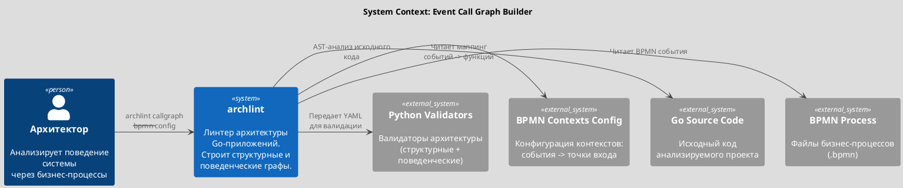
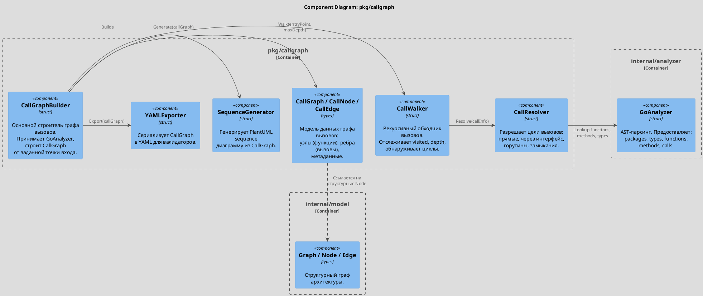
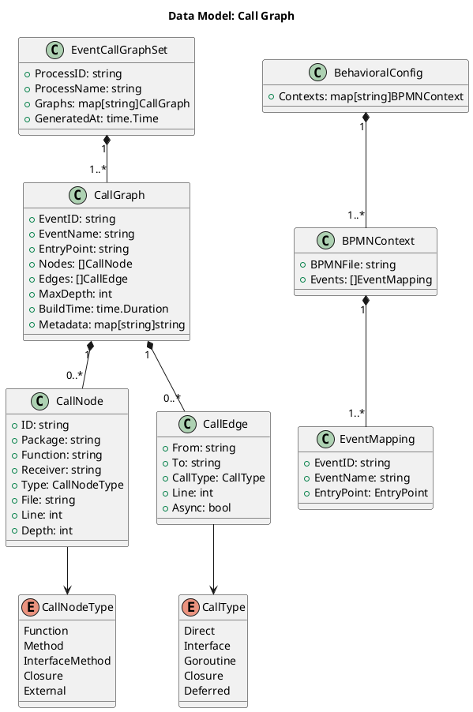
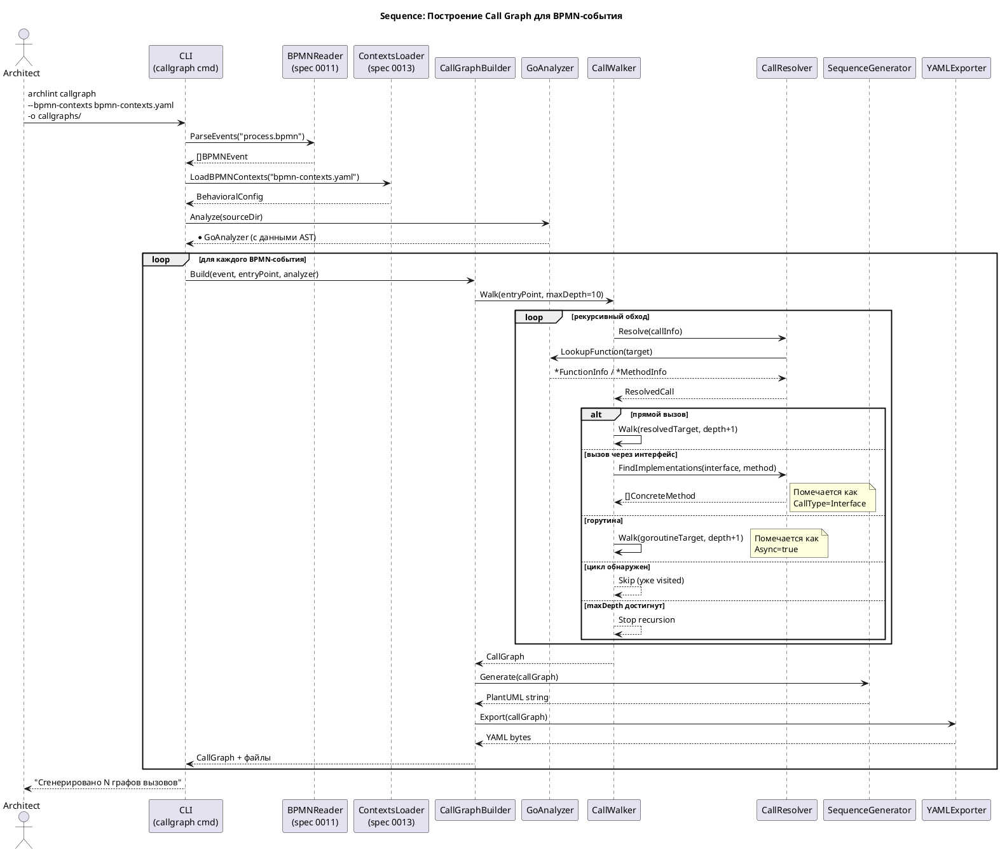
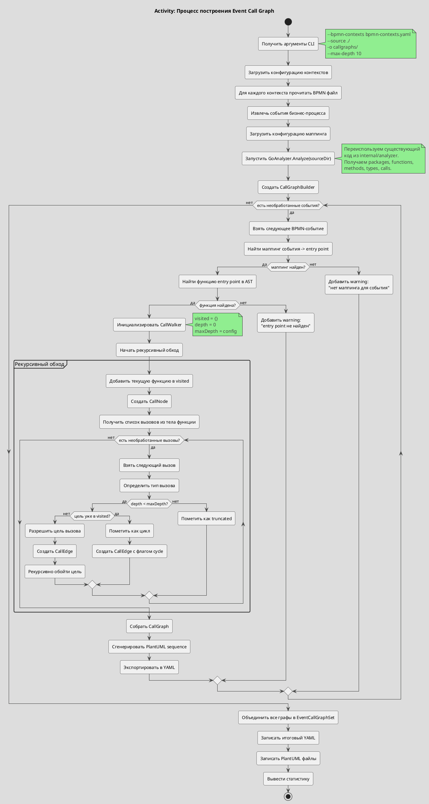
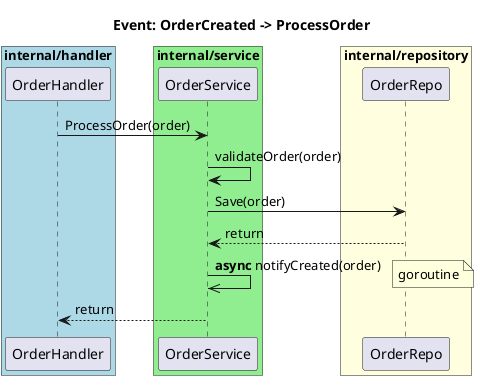

# Spec 0012: Граф вызовов на уровне приложения (Event Call Graph)

**Metadata:**
- Priority: 0012 (High)
- Status: Done
- Created: 2026-02-08
- Effort: L (400-700 строк)
- Parent Spec: 0011 (BPMN Business Process Graph)
- Dependencies: 0011 (BPMN), 0013 (Event-to-Entry-Point Mapping)

---

## Overview

### Problem Statement

Текущий подход archlint к анализу поведения основан на runtime-трассировке (`pkg/tracer`):
необходимо вручную инструментировать код вызовами `tracer.Enter`/`tracer.ExitSuccess`,
запускать тесты, собирать JSON-трассировки и генерировать контексты. Это создает несколько проблем:

1. **Инструментация загрязняет код** - каждая функция содержит boilerplate вызовы трассировщика
2. **Покрытие зависит от тестов** - если тест не покрывает путь выполнения, путь невидим
3. **Нет связи с бизнес-процессами** - трассировки привязаны к тестам, а не к бизнес-событиям
4. **Ручная работа** - нужно поддерживать вызовы tracer.Enter/Exit во всех функциях

Необходимо заменить runtime-трассировку на статический анализ, который автоматически строит
граф вызовов для каждого события бизнес-процесса (BPMN), начиная от точки входа в код.

### Solution Summary

Для каждого события из BPMN-графа бизнес-процесса (spec 0011) построить граф вызовов
на уровне приложения с использованием статического AST-анализа:

1. Получить BPMN-событие и его маппинг на точку входа в код (spec 0013)
2. Найти функцию-точку входа в исходном коде через существующий `GoAnalyzer`
3. Рекурсивно пройти по всем вызовам из тела функции, строя направленный граф
4. Обработать: прямые вызовы, вызовы через интерфейсы, горутины, замыкания
5. Сгенерировать PlantUML sequence-диаграмму для визуализации
6. Выдать YAML с графом вызовов, совместимый с Python-валидаторами

Двухуровневая архитектура:
- Слой 1 (spec 0011): BPMN-граф бизнес-процесса (события, переходы)
- Слой 2 (эта спека): Граф вызовов приложения (функции, вызовы) для каждого события

### Success Metrics

| Метрика              | Целевое значение                                             |
|----------------------|--------------------------------------------------------------|
| Покрытие точек входа | >= 90% событий из BPMN маппятся на call graph                |
| Глубина анализа      | Корректный обход до depth=10 без зацикливания                |
| Время анализа        | < 30 секунд на проект из 50K LOC                             |
| Полнота графа        | Все прямые вызовы + методы найдены (interface - best effort) |
| Совместимость        | YAML выход корректно читается Python-валидаторами            |

---

## Architecture

### System Context (C4 Level 1)



### Container Diagram (C4 Level 2)

```plantuml
@startuml
!include <C4/C4_Container>
!theme toy

title Container Diagram: archlint с Event Call Graph

System_Boundary(archlint, "archlint") {
    Container(cli, "CLI (Cobra)", "Go", "Команды: collect, validate,\ncallgraph")
    Container(analyzer, "GoAnalyzer", "Go", "AST-парсинг Go кода.\nСтроит структурный граф.")
    Container(callgraph_builder, "CallGraphBuilder", "Go", "Строит граф вызовов\nот точки входа.")
    Container(bpmn_reader, "BPMNReader", "Go", "Парсит BPMN XML.\nИзвлекает события.")
    Container(mapping_loader, "ContextsLoader", "Go", "Загружает конфигурацию\nBPMN-контекстов.")
    Container(plantuml_gen, "PlantUMLGenerator", "Go", "Генерирует sequence\nдиаграммы из call graph.")
    Container(yaml_writer, "YAMLWriter", "Go", "Сериализует граф\nв YAML формат.")
    Container(model, "Model", "Go", "Структуры данных:\nGraph, CallGraph, Node, Edge")
}

ContainerDb(bpmn_file, "process.bpmn", "XML", "BPMN бизнес-процесс")
ContainerDb(mapping_file, "bpmn-contexts.yaml", "YAML", "Contexts -> Events -> Entry Points")
ContainerDb(go_src, "Go Source", "Go files", "Исходный код проекта")
ContainerDb(output_yaml, "callgraphs/*.yaml", "YAML", "Графы вызовов")
ContainerDb(output_puml, "callgraphs/*.puml", "PlantUML", "Sequence диаграммы")

cli -> callgraph_builder : "Build(event, entryPoint)"
cli -> bpmn_reader : "ParseEvents()"
cli -> mapping_loader : "LoadBPMNContexts()"
callgraph_builder -> analyzer : "Переиспользует AST-данные\n(packages, functions, methods)"
callgraph_builder -> plantuml_gen : "GenerateSequence(callGraph)"
callgraph_builder -> yaml_writer : "WriteYAML(callGraph)"
bpmn_reader -> bpmn_file : "Читает"
mapping_loader -> mapping_file : "Читает"
analyzer -> go_src : "Парсит"
yaml_writer -> output_yaml : "Записывает"
plantuml_gen -> output_puml : "Записывает"

@enduml
```



### Component Overview (C4 Component)



### Data Model



### Sequence Flow



### Process Flow



---

## Requirements

### R1: CallGraphBuilder

**Описание:** Основной компонент, строящий граф вызовов от точки входа.

**Пакет:** `pkg/callgraph`

**API:**

```go
// CallGraphBuilder строит граф вызовов от заданной точки входа.
type CallGraphBuilder struct {
    analyzer  *analyzer.GoAnalyzer
    maxDepth  int
    options   BuildOptions
}

// BuildOptions настройки построения графа.
type BuildOptions struct {
    MaxDepth          int      // Максимальная глубина рекурсии (default: 10)
    IncludeExternal   bool     // Включать внешние пакеты (default: false)
    IncludeStdlib     bool     // Включать стандартную библиотеку (default: false)
    ExcludePackages   []string // Исключить пакеты по паттерну
    ResolveInterfaces bool     // Пытаться разрешить interface dispatch (default: true)
    TrackGoroutines   bool     // Отслеживать goroutine launches (default: true)
}

// NewCallGraphBuilder создает новый строитель.
func NewCallGraphBuilder(a *analyzer.GoAnalyzer, opts BuildOptions) *CallGraphBuilder

// Build строит граф вызовов от указанной точки входа.
func (b *CallGraphBuilder) Build(entryPoint string) (*CallGraph, error)

// BuildForEvent строит граф вызовов для BPMN-события.
func (b *CallGraphBuilder) BuildForEvent(eventID, eventName, entryPoint string) (*CallGraph, error)
```

**Входные данные:**
- `entryPoint` - полный идентификатор функции (например `internal/service.OrderService.ProcessOrder`)
- `GoAnalyzer` - проинициализированный анализатор с данными AST

**Выходные данные:**
- `*CallGraph` - граф вызовов с узлами и ребрами

**Валидация:**
- Entry point должен существовать в данных GoAnalyzer
- MaxDepth >= 1 и <= 50
- Если entry point не найден - возвращается ошибка `ErrEntryPointNotFound`

---

### R2: CallGraph Data Model

**Описание:** Структуры данных для представления графа вызовов.

**Пакет:** `pkg/callgraph`

**Модель:**

```go
// CallGraph представляет граф вызовов от одной точки входа.
type CallGraph struct {
    EventID    string            `yaml:"event_id,omitempty"`
    EventName  string            `yaml:"event_name,omitempty"`
    EntryPoint string            `yaml:"entry_point"`
    Nodes      []CallNode        `yaml:"nodes"`
    Edges      []CallEdge        `yaml:"edges"`
    MaxDepth   int               `yaml:"max_depth"`
    ActualDepth int              `yaml:"actual_depth"`
    Stats      CallGraphStats    `yaml:"stats"`
    Warnings   []string          `yaml:"warnings,omitempty"`
    BuildTime  time.Duration     `yaml:"-"`
    Metadata   map[string]string `yaml:"metadata,omitempty"`
}

// CallNode представляет узел графа вызовов (функцию или метод).
type CallNode struct {
    ID       string       `yaml:"id"`
    Package  string       `yaml:"package"`
    Function string       `yaml:"function"`
    Receiver string       `yaml:"receiver,omitempty"`
    Type     CallNodeType `yaml:"type"`
    File     string       `yaml:"file,omitempty"`
    Line     int          `yaml:"line,omitempty"`
    Depth    int          `yaml:"depth"`
}

// CallNodeType тип узла графа вызовов.
type CallNodeType string

const (
    NodeFunction        CallNodeType = "function"
    NodeMethod          CallNodeType = "method"
    NodeInterfaceMethod CallNodeType = "interface_method"
    NodeClosure         CallNodeType = "closure"
    NodeExternal        CallNodeType = "external"
)

// CallEdge представляет ребро графа вызовов (вызов).
type CallEdge struct {
    From     string   `yaml:"from"`
    To       string   `yaml:"to"`
    CallType CallType `yaml:"call_type"`
    Line     int      `yaml:"line,omitempty"`
    Async    bool     `yaml:"async,omitempty"`
    Cycle    bool     `yaml:"cycle,omitempty"`
}

// CallType тип вызова.
type CallType string

const (
    CallDirect    CallType = "direct"
    CallInterface CallType = "interface"
    CallGoroutine CallType = "goroutine"
    CallClosure   CallType = "closure"
    CallDeferred  CallType = "deferred"
)

// CallGraphStats статистика по графу.
type CallGraphStats struct {
    TotalNodes      int `yaml:"total_nodes"`
    TotalEdges      int `yaml:"total_edges"`
    MaxDepthReached int `yaml:"max_depth_reached"`
    InterfaceCalls  int `yaml:"interface_calls"`
    GoroutineCalls  int `yaml:"goroutine_calls"`
    CyclesDetected  int `yaml:"cycles_detected"`
    UnresolvedCalls int `yaml:"unresolved_calls"`
}
```

**Инварианты:**
- Каждый `CallNode.ID` уникален в пределах графа
- Каждый `CallEdge.From` и `CallEdge.To` ссылаются на существующий `CallNode.ID`
- `CallGraph.ActualDepth` <= `CallGraph.MaxDepth`
- Entry point всегда является узлом с `Depth=0`

---

### R3: Статический AST-анализ цепочки вызовов

**Описание:** Рекурсивный обход вызовов, начиная от точки входа.

**Пакет:** `pkg/callgraph` (внутренний компонент `CallWalker`)

**Алгоритм:**

```
FUNCTION Walk(functionID, depth):
    IF depth > maxDepth:
        RETURN
    IF functionID IN visited:
        ADD cycleEdge(caller, functionID)
        RETURN

    ADD functionID TO visited
    CREATE CallNode for functionID

    funcInfo = analyzer.LookupFunction(functionID)
    IF funcInfo == nil:
        funcInfo = analyzer.LookupMethod(functionID)
    IF funcInfo == nil:
        CREATE CallNode(type=External)
        RETURN

    FOR EACH call IN funcInfo.Calls:
        resolvedTarget = Resolve(call)

        IF call is goroutine:
            CREATE CallEdge(async=true, type=Goroutine)
        ELSE IF call is interface dispatch:
            CREATE CallEdge(type=Interface)
        ELSE IF call is deferred:
            CREATE CallEdge(type=Deferred)
        ELSE:
            CREATE CallEdge(type=Direct)

        Walk(resolvedTarget, depth + 1)
```

**Обрабатываемые виды вызовов:**

| Вид вызова | Пример кода | CallType | Async |
|------------|-------------|----------|-------|
| Прямой вызов функции | `processOrder(order)` | Direct | false |
| Вызов метода | `s.repo.Save(order)` | Direct | false |
| Вызов через интерфейс | `s.storage.Get(id)` (storage - interface) | Interface | false |
| Горутина | `go s.notify(order)` | Goroutine | true |
| Горутина с замыканием | `go func() { ... }()` | Closure | true |
| Deferred вызов | `defer file.Close()` | Deferred | false |

**Детекция горутин:**
- AST node `*ast.GoStmt` - оборачивает вызов в goroutine
- Вложенный `*ast.CallExpr` - прямой вызов в горутине
- Вложенный `*ast.FuncLit` - замыкание в горутине

**Детекция interface dispatch:**
- Определить тип receiver через поля структуры (из `TypeInfo.Fields`)
- Если тип receiver является интерфейсом (из `TypeInfo.Kind == "interface"`) - пометить как Interface
- Best-effort: попытаться найти конкретные реализации интерфейса

**Детекция циклов:**
- Множество `visited map[string]bool` для текущего пути обхода
- При повторном посещении функции - создать ребро с `Cycle=true`, не рекурсировать

**Ограничение глубины:**
- Настраиваемый `maxDepth` (default: 10)
- При достижении maxDepth - остановить рекурсию, добавить warning

---

### R4: Интеграция Event -> CallGraph

**Описание:** Связь BPMN-событий с графами вызовов через маппинг-конфигурацию.

**Пакет:** `pkg/callgraph`

**API:**

```go
// EventCallGraphBuilder строит графы вызовов для всех событий бизнес-процесса.
type EventCallGraphBuilder struct {
    builder  *CallGraphBuilder
    bpmn     *bpmn.ProcessGraph    // из spec 0011
    contexts *BehavioralConfig      // из spec 0013
}

// BuildAll строит графы вызовов для всех событий, имеющих маппинг.
func (e *EventCallGraphBuilder) BuildAll() (*EventCallGraphSet, error)

// EventCallGraphSet набор графов вызовов по одному бизнес-процессу.
type EventCallGraphSet struct {
    ProcessID   string               `yaml:"process_id"`
    ProcessName string               `yaml:"process_name"`
    Graphs      map[string]CallGraph `yaml:"graphs"`
    GeneratedAt time.Time            `yaml:"generated_at"`
    Stats       SetStats             `yaml:"stats"`
    Warnings    []string             `yaml:"warnings,omitempty"`
}

// SetStats статистика по набору графов.
type SetStats struct {
    TotalEvents    int `yaml:"total_events"`
    MappedEvents   int `yaml:"mapped_events"`
    BuiltGraphs    int `yaml:"built_graphs"`
    FailedGraphs   int `yaml:"failed_graphs"`
    TotalNodes     int `yaml:"total_nodes"`
    TotalEdges     int `yaml:"total_edges"`
}
```

**Workflow:**
1. Получить список BPMN-событий из `bpmn.ProcessGraph` (spec 0011)
2. Для каждого события найти маппинг в `BehavioralConfig.Contexts` (spec 0013)
3. Если маппинг найден - вызвать `CallGraphBuilder.BuildForEvent()`
4. Если маппинг не найден - добавить warning, продолжить
5. Собрать все графы в `EventCallGraphSet`

**Обработка ошибок:**
- Отсутствие маппинга для события - warning, не ошибка
- Entry point не найден в коде - warning для конкретного события
- Ошибка парсинга AST - ошибка, прерывание

---

### R5: Генерация PlantUML Sequence Diagram

**Описание:** Генерация PlantUML sequence-диаграммы из графа вызовов.

**Пакет:** `pkg/callgraph`

**API:**

```go
// SequenceGenerator генерирует PlantUML sequence диаграммы.
type SequenceGenerator struct {
    maxDepth int
    options  SequenceOptions
}

// SequenceOptions настройки генерации диаграммы.
type SequenceOptions struct {
    MaxDepth        int    // Ограничение глубины для диаграммы (default: 5)
    ShowPackages    bool   // Показывать пакет в имени участника (default: true)
    ShowLineNumbers bool   // Показывать номера строк (default: false)
    MarkAsync       bool   // Помечать async вызовы (default: true)
    MarkInterface   bool   // Помечать interface вызовы (default: true)
    GroupByPackage  bool   // Группировать участников по пакетам (default: false)
    Title           string // Заголовок диаграммы
}

// Generate генерирует PlantUML код из графа вызовов.
func (g *SequenceGenerator) Generate(cg *CallGraph) (string, error)
```

**Формат выхода:**



**Особенности рендеринга:**
- Прямые вызовы: `->` (сплошная стрелка)
- Async/goroutine: `->>` (асинхронная стрелка) + пометка "async"
- Interface calls: `->` + стереотип `<<interface>>` в имени
- Cycle: пометка "cycle detected" в note
- Deferred: `->` + пометка "deferred"

---

### R6: CLI Integration

**Описание:** Новая команда CLI для построения графов вызовов.

**Пакет:** `internal/cli`

**Команда:**

```
archlint callgraph [директория] [флаги]

Flags:
  --bpmn-contexts string Файл конфигурации контекстов (bpmn-contexts.yaml)
  --entry string         Точка входа (если без BPMN, одиночный режим)
  -o, --output string    Директория для результатов (default: "callgraphs/")
  --max-depth int        Максимальная глубина анализа (default: 10)
  --format string        Формат вывода: yaml, json (default: "yaml")
  --no-puml              Не генерировать PlantUML диаграммы
  --puml-depth int       Глубина для PlantUML диаграмм (default: 5)
  -l, --language string  Язык (default: "go")
```

**Режимы использования:**

1. **Полный режим (BPMN contexts):**
```bash
archlint callgraph ./src --bpmn-contexts bpmn-contexts.yaml -o callgraphs/
```

2. **Одиночный режим (одна точка входа):**
```bash
archlint callgraph ./src --entry "internal/service.OrderService.ProcessOrder" -o callgraphs/
```

3. **Интеграция с validate:**
```bash
archlint validate architecture.yaml -c callgraphs/event-graphs.yaml
```

**Вывод в консоль:**

```
Анализ кода: ./src (язык: go)
Загрузка контекстов: bpmn-contexts.yaml (3 контекста, 6 событий)
BPMN файлы: processes/order.bpmn, processes/reporting.bpmn, processes/registration.bpmn

Построение графов вызовов:
  [1/6] OrderCreated -> OrderService.ProcessOrder ... OK (12 nodes, 15 edges, depth 7)
  [2/6] PaymentReceived -> PaymentService.Process ... OK (8 nodes, 10 edges, depth 5)
  [3/6] OrderShipped -> ShipmentService.Ship ... OK (6 nodes, 7 edges, depth 4)
  [4/6] OrderCancelled -> OrderService.Cancel ... WARN: entry point not found
  [5/6] RefundRequested -> RefundService.Process ... OK (10 nodes, 13 edges, depth 6)
  [6/6] OrderCompleted -> OrderService.Complete ... OK (5 nodes, 6 edges, depth 3)

Результат: 5 графов построено, 1 warning
Файлы:
  - callgraphs/event-graphs.yaml
  - callgraphs/order-created.puml
  - callgraphs/payment-received.puml
  - callgraphs/order-shipped.puml
  - callgraphs/refund-requested.puml
  - callgraphs/order-completed.puml
```

---

### R7: Output Format

**Описание:** Формат выходных файлов - YAML, совместимый с Python-валидаторами.

**YAML формат (event-graphs.yaml):**

```yaml
process_id: "order-processing"
process_name: "Order Processing"
generated_at: "2026-02-08T14:30:00Z"
stats:
  total_events: 8
  mapped_events: 6
  built_graphs: 5
  failed_graphs: 1
  total_nodes: 41
  total_edges: 51
warnings:
  - "Event 'OrderCancelled': entry point 'OrderService.Cancel' not found"

graphs:
  order-created:
    event_id: "order-created"
    event_name: "OrderCreated"
    entry_point: "internal/service.OrderService.ProcessOrder"
    max_depth: 10
    actual_depth: 7
    stats:
      total_nodes: 12
      total_edges: 15
      max_depth_reached: 7
      interface_calls: 3
      goroutine_calls: 1
      cycles_detected: 0
      unresolved_calls: 2
    nodes:
      - id: "internal/service.OrderService.ProcessOrder"
        package: "internal/service"
        function: "ProcessOrder"
        receiver: "OrderService"
        type: "method"
        file: "internal/service/order.go"
        line: 42
        depth: 0
      - id: "internal/service.OrderService.validateOrder"
        package: "internal/service"
        function: "validateOrder"
        receiver: "OrderService"
        type: "method"
        file: "internal/service/order.go"
        line: 78
        depth: 1
      - id: "internal/repository.OrderRepository.Save"
        package: "internal/repository"
        function: "Save"
        receiver: "OrderRepository"
        type: "interface_method"
        file: ""
        line: 0
        depth: 2
    edges:
      - from: "internal/service.OrderService.ProcessOrder"
        to: "internal/service.OrderService.validateOrder"
        call_type: "direct"
        line: 45
      - from: "internal/service.OrderService.ProcessOrder"
        to: "internal/repository.OrderRepository.Save"
        call_type: "interface"
        line: 52
      - from: "internal/service.OrderService.ProcessOrder"
        to: "internal/service.OrderService.notifyCreated"
        call_type: "goroutine"
        line: 58
        async: true
```

**Совместимость с Python-валидаторами:**
- Формат совместим с существующим `contexts.yaml` (поле `components` заменяется на `nodes`)
- Поле `edges` дополняет информацию о связях из структурного графа
- Python-валидаторы могут загружать `event-graphs.yaml` через `-c` флаг команды `validate`
- Граф вызовов дополняет (не заменяет) структурный граф из `architecture.yaml`

---

## Acceptance Criteria

### Построение графа

1. **AC-01:** `CallGraphBuilder.Build()` корректно строит граф для функции с 3+ уровнями вложенности вызовов
2. **AC-02:** Прямые вызовы функций (не методов) корректно обнаруживаются и добавляются в граф
3. **AC-03:** Вызовы методов через receiver корректно обнаруживаются с правильным receiver type
4. **AC-04:** Вызовы через интерфейс помечаются как `CallType=Interface`
5. **AC-05:** Горутины (`go func()`, `go method()`) помечаются как `Async=true, CallType=Goroutine`
6. **AC-06:** Deferred вызовы помечаются как `CallType=Deferred`
7. **AC-07:** Циклы в цепочке вызовов обнаруживаются и помечаются `Cycle=true`, без бесконечной рекурсии
8. **AC-08:** Ограничение `MaxDepth` корректно останавливает рекурсию

### Интеграция с BPMN

9. **AC-09:** `EventCallGraphBuilder.BuildAll()` строит графы для всех событий с маппингом
10. **AC-10:** События без маппинга добавляются в `Warnings`, обработка не прерывается
11. **AC-11:** Entry point, не найденный в коде, добавляется в `Warnings` конкретного графа

### Генерация PlantUML

12. **AC-12:** Sequence-диаграмма корректно генерируется для графа с 5+ узлами
13. **AC-13:** Async вызовы визуально отличаются от синхронных на диаграмме
14. **AC-14:** Interface вызовы помечены стереотипом на диаграмме
15. **AC-15:** `SequenceOptions.MaxDepth` ограничивает глубину диаграммы независимо от глубины графа

### CLI

16. **AC-16:** Команда `archlint callgraph ./src --entry "pkg.Func"` работает в одиночном режиме
17. **AC-17:** Команда `archlint callgraph ./src --bpmn X --config Y` работает в полном режиме
18. **AC-18:** Флаг `--max-depth` корректно ограничивает глубину анализа
19. **AC-19:** Флаг `--no-puml` подавляет генерацию PlantUML файлов

### Выходные данные

20. **AC-20:** YAML-файл валиден и корректно парсится Python `yaml.safe_load()`
21. **AC-21:** Все `CallEdge.From` и `CallEdge.To` ссылаются на существующие `CallNode.ID`
22. **AC-22:** `Stats` корректно считают количество узлов, ребер, interface/goroutine вызовов

### Совместимость

23. **AC-23:** Переиспользуется существующий `GoAnalyzer` без дублирования парсинга AST
24. **AC-24:** Формат YAML совместим с Python-валидаторами (загружается через `-c` флаг `validate`)
25. **AC-25:** Команда не ломает существующие команды `collect`, `trace`, `validate`

---

## Implementation Steps

### Phase 1: Data Model и CallGraphBuilder (core)

**Цель:** Базовая модель и строитель графа вызовов для одной точки входа.

**Step 1.1:** Создать пакет `pkg/callgraph/`

Файлы:
- `pkg/callgraph/model.go` - модель данных (CallGraph, CallNode, CallEdge, enums)
- `pkg/callgraph/errors.go` - ошибки (ErrEntryPointNotFound, ErrMaxDepthExceeded)

**Step 1.2:** Расширить GoAnalyzer для экспорта внутренних данных

Добавить в `internal/analyzer/go.go` методы для доступа к данным:

```go
// LookupFunction возвращает информацию о функции по ID.
func (a *GoAnalyzer) LookupFunction(funcID string) *FunctionInfo

// LookupMethod возвращает информацию о методе по ID.
func (a *GoAnalyzer) LookupMethod(methodID string) *MethodInfo

// LookupType возвращает информацию о типе по ID.
func (a *GoAnalyzer) LookupType(typeID string) *TypeInfo

// FindMethodsByReceiver возвращает все методы для данного receiver type.
func (a *GoAnalyzer) FindMethodsByReceiver(receiverType string) []*MethodInfo

// FindImplementations ищет конкретные типы, реализующие интерфейс.
func (a *GoAnalyzer) FindImplementations(interfaceID string) []string

// AllFunctions возвращает все найденные функции.
func (a *GoAnalyzer) AllFunctions() map[string]*FunctionInfo

// AllMethods возвращает все найденные методы.
func (a *GoAnalyzer) AllMethods() map[string]*MethodInfo
```

**Step 1.3:** Реализовать CallWalker

Файл: `pkg/callgraph/walker.go`

- Рекурсивный обход от entry point
- Множество visited для обнаружения циклов
- Ограничение глубины
- Сбор CallNode и CallEdge

**Step 1.4:** Реализовать CallResolver

Файл: `pkg/callgraph/resolver.go`

- Разрешение прямых вызовов (функции и методы)
- Разрешение вызовов через receiver с определением типа
- Пометка interface dispatch
- Пометка горутин (потребуется доп. информация из AST - см. Step 1.5)

**Step 1.5:** Расширить AST-парсинг для горутин и defer

Добавить в `internal/analyzer/go.go` расширенный сбор информации:
- В `collectCalls()` определять, что вызов внутри `go` statement
- В `collectCalls()` определять, что вызов внутри `defer` statement
- Добавить поля в `CallInfo`: `IsGoroutine bool`, `IsDeferred bool`

**Step 1.6:** Реализовать CallGraphBuilder

Файл: `pkg/callgraph/builder.go`

- Оркестрация: инициализация walker, вызов Walk, сбор результата
- Подсчет статистики
- Формирование warnings

### Phase 2: PlantUML и YAML экспорт

**Цель:** Генерация выходных файлов.

**Step 2.1:** Реализовать SequenceGenerator

Файл: `pkg/callgraph/sequence.go`

- Обход графа вызовов в порядке DFS
- Формирование PlantUML sequence-диаграммы
- Группировка участников по пакетам
- Визуальное различие async/interface/deferred вызовов

**Step 2.2:** Реализовать YAMLExporter

Файл: `pkg/callgraph/export.go`

- Сериализация CallGraph в YAML
- Сериализация EventCallGraphSet в YAML
- Валидация ссылочной целостности перед экспортом

### Phase 3: Event Integration и CLI

**Цель:** Связь с BPMN-событиями и CLI-команда.

**Step 3.1:** Реализовать EventCallGraphBuilder

Файл: `pkg/callgraph/event_builder.go`

- Прием BPMN-событий (из spec 0011) и маппинга (из spec 0013)
- Итерация по событиям, построение графов
- Сбор в EventCallGraphSet

**Step 3.2:** Реализовать CLI-команду callgraph

Файл: `internal/cli/callgraph.go`

- Cobra-команда `callgraph`
- Поддержка двух режимов: одиночный (--entry) и полный (--bpmn + --config)
- Вывод прогресса и статистики

**Step 3.3:** Интеграция с командой validate

Обновить `internal/cli/validate.go`:
- Принимать `callgraphs/*.yaml` через `-c` флаг
- Передавать данные графов вызовов в Python-валидаторы

### Phase 4: Тестирование и полировка

**Цель:** Полное покрытие тестами и документация.

**Step 4.1:** Unit-тесты для CallWalker и CallResolver

**Step 4.2:** Unit-тесты для SequenceGenerator

**Step 4.3:** Integration-тест: полный цикл от Go source до YAML + PlantUML

**Step 4.4:** Тест на реальном проекте (archlint сам на себе - dogfooding)

**Step 4.5:** Удаление (или deprecation) зависимости от `pkg/tracer` в коде archlint

---

## Testing Strategy

### Unit Tests

**Файл:** `pkg/callgraph/builder_test.go`

```go
func TestCallGraphBuilder_SimpleChain(t *testing.T) {
    // A -> B -> C
    // Проверить: 3 nodes, 2 edges, depth=2
}

func TestCallGraphBuilder_CycleDetection(t *testing.T) {
    // A -> B -> C -> A
    // Проверить: cycle edge, нет бесконечного цикла
}

func TestCallGraphBuilder_MaxDepth(t *testing.T) {
    // A -> B -> C -> D -> E (maxDepth=3)
    // Проверить: только 4 nodes (A, B, C, D), E не включен
}

func TestCallGraphBuilder_GoroutineDetection(t *testing.T) {
    // A -> go B()
    // Проверить: edge с Async=true, CallType=Goroutine
}

func TestCallGraphBuilder_InterfaceCall(t *testing.T) {
    // A.Process() вызывает s.repo.Save() где repo - interface
    // Проверить: edge с CallType=Interface
}

func TestCallGraphBuilder_EntryPointNotFound(t *testing.T) {
    // Несуществующая функция
    // Проверить: ErrEntryPointNotFound
}

func TestCallGraphBuilder_EmptyFunction(t *testing.T) {
    // Функция без вызовов
    // Проверить: 1 node, 0 edges
}
```

**Файл:** `pkg/callgraph/walker_test.go`

```go
func TestCallWalker_VisitedTracking(t *testing.T) {
    // Проверить корректность visited set
}

func TestCallWalker_DepthTracking(t *testing.T) {
    // Проверить корректность depth для каждого узла
}
```

**Файл:** `pkg/callgraph/resolver_test.go`

```go
func TestCallResolver_DirectFunction(t *testing.T)
func TestCallResolver_MethodCall(t *testing.T)
func TestCallResolver_InterfaceDispatch(t *testing.T)
func TestCallResolver_UnresolvedCall(t *testing.T)
```

**Файл:** `pkg/callgraph/sequence_test.go`

```go
func TestSequenceGenerator_BasicDiagram(t *testing.T) {
    // Проверить формирование PlantUML для простого графа
}

func TestSequenceGenerator_AsyncCalls(t *testing.T) {
    // Проверить пометку async вызовов
}

func TestSequenceGenerator_MaxDepthTruncation(t *testing.T) {
    // Проверить ограничение глубины диаграммы
}
```

**Файл:** `pkg/callgraph/export_test.go`

```go
func TestYAMLExporter_ValidOutput(t *testing.T) {
    // Проверить что YAML валиден и парсится обратно
}

func TestYAMLExporter_ReferentialIntegrity(t *testing.T) {
    // Проверить что все From/To ссылаются на существующие ID
}
```

### Integration Tests

**Файл:** `tests/callgraph_test.go`

```go
func TestCallGraph_FullCycle(t *testing.T) {
    // 1. Создать testdata/ с Go файлами
    // 2. Запустить GoAnalyzer.Analyze()
    // 3. Запустить CallGraphBuilder.Build()
    // 4. Проверить корректность графа
    // 5. Сгенерировать PlantUML
    // 6. Сгенерировать YAML
    // 7. Проверить что YAML парсится обратно
}

func TestCallGraph_SelfDogfooding(t *testing.T) {
    // Запустить callgraph на исходном коде archlint
    // Entry point: internal/cli.Execute
    // Проверить что граф корректен
}
```

**Тестовые данные:** `tests/testdata/callgraph/`

```go
// tests/testdata/callgraph/main.go
package main

func main() {
    svc := NewService(&repoImpl{})
    svc.Process("order-1")
}

// tests/testdata/callgraph/service.go
package main

type Repository interface {
    Save(id string) error
    Get(id string) (string, error)
}

type Service struct {
    repo Repository
}

func NewService(repo Repository) *Service {
    return &Service{repo: repo}
}

func (s *Service) Process(id string) error {
    data, err := s.repo.Get(id)
    if err != nil {
        return err
    }
    result := transform(data)
    go s.notify(id, result)
    return s.repo.Save(id)
}

func (s *Service) notify(id, result string) {
    // async notification
}

func transform(data string) string {
    return validate(data)
}

func validate(data string) string {
    return data
}
```

Ожидаемый граф для entry point `Service.Process`:

```
Service.Process (depth=0)
  -> Repository.Get (depth=1, interface)
  -> transform (depth=1, direct)
    -> validate (depth=2, direct)
  -> Service.notify (depth=1, goroutine, async)
  -> Repository.Save (depth=1, interface)
```

---

## Notes

### Design Decisions

**DD-01: Отдельный пакет `pkg/callgraph` вместо расширения `internal/analyzer`**

Граф вызовов - это отдельная концепция от структурного графа. `GoAnalyzer` строит
структурный граф (компоненты, импорты, зависимости типов). `CallGraphBuilder` строит
поведенческий граф (цепочки вызовов от точки входа). Разделение по пакетам сохраняет
SRP и позволяет тестировать независимо.

`CallGraphBuilder` использует `GoAnalyzer` как источник данных через публичные методы
(Lookup-функции), не дублируя парсинг AST.

**DD-02: Статический анализ вместо runtime-трассировки**

Runtime-трассировка (текущий `pkg/tracer`) требует инструментации кода и зависит от
покрытия тестов. Статический анализ:
- Не требует изменения анализируемого кода
- Покрывает все пути (не только те, что выполняются в тестах)
- Работает быстрее (один проход по AST)
- Обнаруживает interface dispatch (best-effort)

Ограничения статического анализа:
- Interface dispatch разрешается не всегда (помечается как interface)
- Reflection-вызовы не обнаруживаются
- Динамическая диспетчеризация через function values неточна

**DD-03: Расширение `CallInfo` вместо нового AST-парсера**

Для определения горутин и deferred нужна дополнительная информация из AST.
Вместо создания нового парсера - расширяем существующий `collectCalls()` в `GoAnalyzer`:
добавляем поля `IsGoroutine` и `IsDeferred` в `CallInfo`. Это минимальное изменение
с максимальным эффектом.

**DD-04: Двухуровневая модель (BPMN -> Call Graph)**

Бизнес-процесс (BPMN) описывает "что происходит" на уровне бизнеса.
Call Graph описывает "как это реализовано" на уровне кода.
Маппинг (spec 0013) связывает два уровня.

Это позволяет:
- Валидировать соответствие кода бизнес-процессу
- Обнаруживать "мертвые" события (есть в BPMN, нет в коде)
- Визуализировать impact бизнес-событий на кодовую базу

### Code Examples

**Пример использования CallGraphBuilder напрямую:**

```go
package main

import (
    "fmt"
    "github.com/mshogin/archlint/internal/analyzer"
    "github.com/mshogin/archlint/pkg/callgraph"
)

func main() {
    // 1. Анализируем код
    goAnalyzer := analyzer.NewGoAnalyzer()
    _, err := goAnalyzer.Analyze("./src")
    if err != nil {
        panic(err)
    }

    // 2. Строим граф вызовов
    builder := callgraph.NewCallGraphBuilder(goAnalyzer, callgraph.BuildOptions{
        MaxDepth:          10,
        ResolveInterfaces: true,
        TrackGoroutines:   true,
    })

    cg, err := builder.Build("internal/service.OrderService.ProcessOrder")
    if err != nil {
        panic(err)
    }

    fmt.Printf("Nodes: %d, Edges: %d, Depth: %d\n",
        cg.Stats.TotalNodes, cg.Stats.TotalEdges, cg.ActualDepth)

    // 3. Генерируем PlantUML
    gen := callgraph.NewSequenceGenerator(callgraph.SequenceOptions{
        MaxDepth:     5,
        ShowPackages: true,
        MarkAsync:    true,
    })

    puml, err := gen.Generate(cg)
    if err != nil {
        panic(err)
    }
    fmt.Println(puml)
}
```

**Пример расширения collectCalls для горутин:**

```go
// В internal/analyzer/go.go, метод collectCalls:

ast.Inspect(body, func(n ast.Node) bool {
    switch stmt := n.(type) {
    case *ast.GoStmt:
        // Горутина: go f() или go func() { ... }()
        call := stmt.Call
        // ... извлекаем информацию о вызове
        calls = append(calls, CallInfo{
            Target:      target,
            IsMethod:    isMethod,
            Receiver:    receiver,
            Line:        pos.Line,
            IsGoroutine: true,
        })
        return false // не обходить children повторно

    case *ast.DeferStmt:
        // Deferred вызов: defer f()
        call := stmt.Call
        // ... извлекаем информацию о вызове
        calls = append(calls, CallInfo{
            Target:     target,
            IsMethod:   isMethod,
            Receiver:   receiver,
            Line:       pos.Line,
            IsDeferred: true,
        })
        return false
    }
    return true
})
```

### References

- spec 0011: BPMN Business Process Graph (parent)
- spec 0013: Event-to-Entry-Point Mapping Configuration (dependency)
- `internal/analyzer/go.go` - существующий AST-анализатор, база для расширения
- `internal/model/model.go` - существующая модель Graph/Node/Edge
- `pkg/tracer/` - текущий runtime-трассировщик (заменяется этой спекой)
- `pkg/tracer/context_generator.go` - текущая генерация контекстов (заменяется)
- `internal/cli/trace.go` - текущая CLI-команда trace (заменяется callgraph)
- golang.org/x/tools/go/callgraph - референсная реализация call graph в Go toolchain
- golang.org/x/tools/go/ssa - SSA-представление, альтернативный подход (более точный, но тяжелый)

### Альтернативы

**SSA-based call graph (golang.org/x/tools/go/callgraph):**

Библиотека `golang.org/x/tools` предоставляет точные алгоритмы построения call graph
(CHA, RTA, VTA). Они используют SSA-представление и более точно разрешают interface dispatch.

Причины выбора AST-подхода:
- `GoAnalyzer` уже парсит AST и собирает вызовы - переиспользуем
- SSA требует компилируемый код (все зависимости скачаны)
- AST-подход проще и быстрее для первой итерации
- Можно мигрировать на SSA позже (Step 1.4 resolver заменяется)

**Гибридный подход (AST + опциональный SSA):**

В будущем можно добавить `--precise` флаг, который использует SSA для точного
разрешения interface dispatch, сохраняя AST как default (быстрый, без требования
компилируемости).
