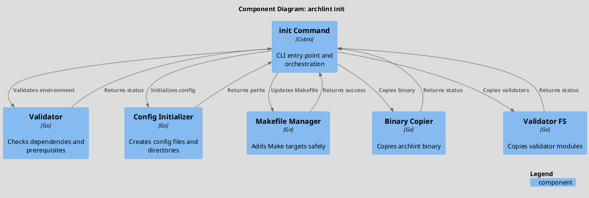
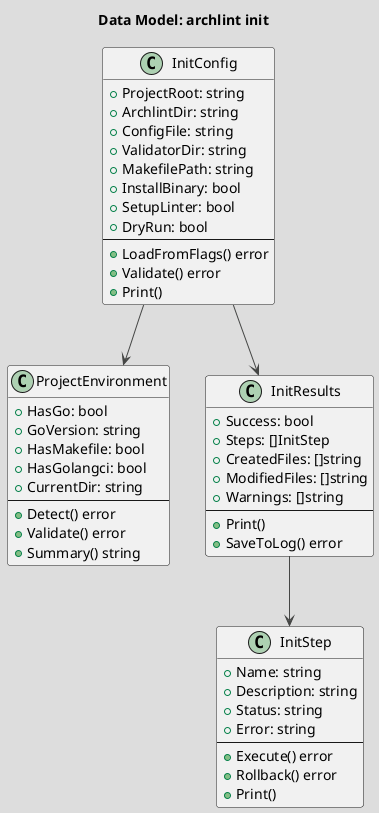
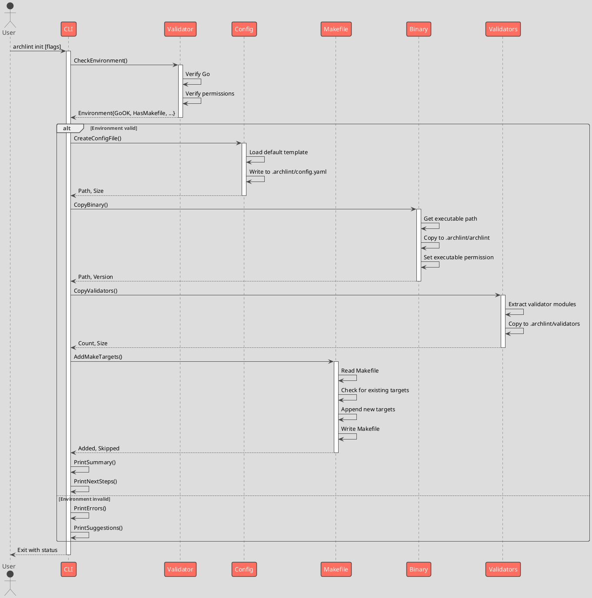

# Spec 0015: archlint init - Project Initialization Command

**EN** | [RU](0015-archlint-init-command.md)

**Metadata:**
- Priority: 0015 (High)
- Status: Todo
- Created: 2026-03-10
- Effort: M
- Owner: -
- Parent Spec: -

---

## Overview

### Problem Statement

When developers want to use archlint in their projects, they need to:
1. Manually configure Make targets for all commands
2. Create directory structure (.archlint/)
3. Set up configuration files
4. Copy binary and validators
5. Optionally set up linting infrastructure

This manual setup is error-prone and repetitive. Most developers just want to run `archlint init` and have everything configured.

### Solution Summary

Implement `archlint init` command that:
- Creates `.archlint/` directory structure
- Initializes default configuration (`config.yaml`)
- Copies archlint binary to `.archlint/archlint`
- Copies validator modules to `.archlint/validators`
- Adds Make targets to project Makefile (non-destructive)
- Optionally sets up golangci-lint if not present
- Verifies Go installation

### Success Metrics
- Single command initializes complete archlint setup
- Make targets work immediately after init
- Zero manual configuration needed
- Backward compatible with existing Makefiles
- Clear messaging about what was created/modified

---

## Architecture

### Component Overview (C4 Component)



---

### Data Model (UML Class Diagram)



---

## Requirements

### Functional Requirements

**FR1: Environment Validation**
- Description: Validate that project can use archlint
- Checks:
  * Go installation (version >= 1.18)
  * Makefile exists or can be created
  * Write permissions in project root
  * Not already initialized (warning only)
- Output: Status report with recommendations

**FR2: Directory Structure**
- Description: Create .archlint directory with subdirectories
- Creates:
  * `.archlint/` - main directory
  * `.archlint/validators/` - validator modules
  * `.archlint/cache/` - optional cache directory
- Behavior: Skip if exists (with message)

**FR3: Configuration File**
- Description: Create default `config.yaml` in `.archlint/`
- Contents:
  * Architecture file path
  * Validation groups
  * Output format preferences
  * Custom rules configuration
- Template: Use embedded template or read from archlint package

**FR4: Binary Management**
- Description: Copy archlint binary to `.archlint/`
- Source: Current executable or download from release
- Destination: `.archlint/archlint`
- Permissions: Executable (755)
- Behavior: Overwrite if exists, show version

**FR5: Validator Installation**
- Description: Copy validator modules to `.archlint/validators/`
- Source: Embedded in archlint binary or bundled
- Includes:
  * Python validator modules
  * Configuration loader
  * Common utilities
- Permissions: Readable by make/CLI

**FR6: Makefile Integration**
- Description: Non-destructively add Make targets
- Targets added:
  * `make arch-collect` - collect architecture
  * `make arch-collect-struct` - structural analysis
  * `make arch-validate` - full validation
  * `make arch-validate-struct` - structural validation
  * `make arch-validate-trace` - behavioral validation
  * `make lint` - add lint target if missing (with golangci-lint setup)
- Non-destructive: Check for duplicates, append if missing
- Backup: Create `.Makefile.backup` if modifying

**FR7: Optional Linter Setup**
- Description: Install/configure golangci-lint if requested
- Check: If `.golangci.yml` exists, skip
- Setup:
  * Copy default `.golangci.yml` from archlint
  * Install golangci-lint binary if missing
  * Add `make lint` target
- Flag: `--setup-linter` (default: auto-detect)

**FR8: Dry Run Mode**
- Description: Show what would be done without changes
- Flag: `--dry-run`
- Output: Report of all changes without executing
- Usage: Safe preview before commitment

### Non-Functional Requirements

**NFR1: Idempotency**
- Running init twice should be safe
- Skip existing files/targets with clear messages
- No data loss

**NFR2: Rollback Capability**
- On error, attempt to undo partial changes
- Create backup of modified files (`.backup`)
- Clear instructions for manual rollback

**NFR3: Clear Messaging**
- Progress output with status
- Clear success/failure messages
- Helpful hints for common issues
- Summary at end with next steps

**NFR4: Performance**
- Complete in <5 seconds for typical project
- Minimal disk I/O
- Parallel operations where safe (directory creation)

**NFR5: Cross-Platform**
- Works on Linux, macOS, Windows
- Handle path separators correctly
- Respect platform conventions

---

## Sequence Flow



---

## Acceptance Criteria

### AC1: Environment Validation
- [ ] Detects Go installation correctly
- [ ] Detects Go version >= 1.18
- [ ] Checks write permissions in project root
- [ ] Reports clear error messages for failures
- [ ] Suggests fixes (e.g., "Install Go 1.18+")

### AC2: Directory Structure
- [ ] Creates `.archlint/` directory
- [ ] Creates `.archlint/validators/` subdirectory
- [ ] Creates `.archlint/cache/` subdirectory
- [ ] Skips creation if directories exist
- [ ] Shows clear messages about what was created

### AC3: Configuration File
- [ ] Creates `.archlint/config.yaml` with valid YAML
- [ ] Default config has all required fields
- [ ] Comments explain each configuration option
- [ ] Can be immediately used by `archlint validate`
- [ ] Respects `--config` flag to customize path

### AC4: Binary Installation
- [ ] Copies archlint binary to `.archlint/archlint`
- [ ] Sets executable permissions (755 on Unix)
- [ ] Binary is executable and works
- [ ] Shows version of installed binary
- [ ] Overwrites if exists with confirmation message

### AC5: Validator Installation
- [ ] Copies all validator modules to `.archlint/validators/`
- [ ] Maintains directory structure (structure/, behavior/, etc.)
- [ ] All Python validators are present
- [ ] `__init__.py` files are correct
- [ ] Validators can be run by Python

### AC6: Makefile Integration
- [ ] Adds all 6 Make targets (collect, validate variants)
- [ ] Targets work immediately after init
- [ ] Doesn't duplicate if run twice
- [ ] Creates `.Makefile.backup` before modifying
- [ ] Respects existing `make lint` target

### AC7: Linter Setup (Optional)
- [ ] `--setup-linter` flag installs golangci-lint
- [ ] Copies default `.golangci.yml` from archlint
- [ ] Skips if `.golangci.yml` exists
- [ ] Adds `make lint` target if missing
- [ ] Linting works immediately after init

### AC8: Dry Run Mode
- [ ] `--dry-run` shows all changes without executing
- [ ] Reports files that would be created
- [ ] Reports Makefile modifications
- [ ] No actual changes are made
- [ ] Exit code indicates success

### AC9: Error Handling
- [ ] Gracefully handles permission errors
- [ ] Provides rollback on critical errors
- [ ] Creates `.Makefile.backup` on modification
- [ ] Shows clear error messages
- [ ] Suggests recovery steps

### AC10: Messaging & UX
- [ ] Shows progress for each step
- [ ] Clear success summary at end
- [ ] Lists next steps (e.g., "Run: make arch-collect")
- [ ] Helpful hints for common issues
- [ ] Color-coded output (success/warning/error)

### AC11: Idempotency
- [ ] Can run init twice safely
- [ ] Second run skips existing files
- [ ] No data loss on re-run
- [ ] Clear messages about skipped items

### AC12: Cross-Platform
- [ ] Works on Linux (tested)
- [ ] Works on macOS (tested)
- [ ] Works on Windows (tested)
- [ ] Handles path separators correctly
- [ ] Respects platform conventions

---

## Implementation Plan

### Phase 1: Core Initialization (Steps 1-4)
**Goal:** Basic directory and config setup

**Step 1.1: Create init Command Structure**
- Files: `internal/cli/init.go`
- Create cobra Command with flags:
  * `--dry-run`: Preview changes
  * `--setup-linter`: Install golangci-lint
  * `--force`: Overwrite existing files
  * `--config-template`: Custom template path

**Step 1.2: Implement Environment Validator**
- Files: `internal/init/validator.go`
- Functions:
  * `CheckGoInstallation() error`
  * `CheckPermissions() error`
  * `CheckExistingSetup() (bool, error)`
  * `DetectEnvironment() (*Environment, error)`
- Tests: `internal/init/validator_test.go`

**Step 1.3: Implement Config Initializer**
- Files: `internal/init/config.go`
- Functions:
  * `CreateConfigDirectory() error`
  * `CreateDefaultConfig() error`
  * `LoadConfigTemplate() ([]byte, error)`
  * `WriteConfigFile(path string) error`
- Embed default config template as constant
- Tests: `internal/init/config_test.go`

**Step 1.4: Implement Result Tracking**
- Files: `internal/init/results.go`
- Track:
  * Created files and directories
  * Modified files
  * Warnings and errors
  * Execution time
- Methods for pretty-printing results

### Phase 2: Binary & Validators (Steps 5-6)
**Goal:** Install archlint binary and validators

**Step 2.1: Implement Binary Copier**
- Files: `internal/init/binary.go`
- Functions:
  * `GetExecutablePath() (string, error)`
  * `CopyBinary(dest string) error`
  * `SetExecutablePermissions(path string) error`
  * `VerifyBinaryWorks(path string) error`
- Tests: `internal/init/binary_test.go`

**Step 2.2: Implement Validator Copier**
- Files: `internal/init/validators.go`
- Functions:
  * `CopyValidators(destDir string) error`
  * `EnsureValidatorStructure(path string) error`
  * `VerifyValidators(path string) error`
- Handle embedded validators or filesystem
- Tests: `internal/init/validators_test.go`

### Phase 3: Makefile Integration (Steps 7-8)
**Goal:** Safe Makefile modification

**Step 3.1: Implement Makefile Parser**
- Files: `internal/init/makefile.go`
- Functions:
  * `ParseMakefile(path string) (*Makefile, error)`
  * `HasTarget(name string) bool`
  * `AddTarget(name, body string) error`
  * `WriteMakefile() error`
  * `CreateBackup() error`
- Safely parse and preserve existing content
- Tests: `internal/init/makefile_test.go`

**Step 3.2: Add Makefile Targets**
- Create make target definitions in separate file
- Targets:
  * `arch-collect`: Run archlint collect
  * `arch-collect-struct`: Structural analysis
  * `arch-collect-trace`: Behavioral analysis
  * `arch-validate`: Full validation
  * `arch-validate-struct`: Structural validation
  * `arch-validate-trace`: Behavioral validation
- Include help text and comments

### Phase 4: Linter Setup (Steps 9-10)
**Goal:** Optional golangci-lint integration

**Step 4.1: Implement Linter Initializer**
- Files: `internal/init/linter.go`
- Functions:
  * `CheckGolangciLint() bool`
  * `InstallGolangciLint() error`
  * `CreateGolangciConfig() error`
  * `AddLintTarget() error`
- Embed default `.golangci.yml` as constant
- Tests: `internal/init/linter_test.go`

**Step 4.2: Create Default Golangci Config**
- Embed archlint's recommended `.golangci.yml`
- Include comments explaining each setting
- Should match project's linting standards

### Phase 5: Integration & Orchestration (Steps 11-12)
**Goal:** Tie everything together

**Step 5.1: Implement Init Orchestrator**
- Files: `internal/init/executor.go`
- Functions:
  * `Execute(config *InitConfig) (*InitResults, error)`
  * `ExecuteDryRun(config *InitConfig) (*InitResults, error)`
  * `Rollback(results *InitResults) error`
- Coordinate all phases in correct order
- Handle errors and rollback

**Step 5.2: Implement Messaging Layer**
- Files: `internal/init/output.go`
- Functions:
  * `PrintProgress(step string)`
  * `PrintSuccess(message string)`
  * `PrintWarning(message string)`
  * `PrintError(message string)`
  * `PrintSummary(results *InitResults)`
  * `PrintNextSteps(config *InitConfig)`
- Color-coded output
- Progress indicators

### Phase 6: Testing & Documentation (Steps 13-14)
**Goal:** Comprehensive testing and docs

**Step 6.1: Integration Tests**
- File: `internal/init/integration_test.go`
- Tests:
  * Full init flow on temporary project
  * Dry run vs actual execution
  * Error recovery and rollback
  * Cross-platform paths
  * Idempotency (init twice)

**Step 6.2: Update Documentation**
- Update `README.md` with init command
- Add `docs/init.md` with full guide
- Update `QUICKSTART.md` with init instructions
- Add examples of post-init workflow

---

## Dependencies

### Internal Dependencies
- `internal/cli` - for Cobra command structure
- `internal/config` - for configuration loading
- Embedded assets (binary, validators, configs)

### External Dependencies
- `github.com/spf13/cobra` - CLI framework (already used)
- `golang.org/x/sys/unix` - for file permissions (platform-specific)
- No new external dependencies

### Runtime Dependencies
- Go 1.18+ (for build and initialization)
- Make (for target execution)
- Python 3.8+ (for validators)

---

## Risks & Mitigations

| Risk | Impact | Probability | Mitigation |
|------|--------|-------------|-----------|
| Makefile corruption | High | Medium | Create backup before modification, test parsing |
| Permission denied | High | Low | Check permissions early, clear error messages |
| Large binary size | Medium | Low | Keep binary ~10MB, validators separate |
| Cross-platform issues | Medium | Medium | Test on Linux, macOS, Windows in CI |
| User cancels mid-init | Medium | Low | Create rollback mechanism, clear prompts |

---

## Testing Strategy

### Unit Tests
- [ ] Validator: Go detection, permissions, environment
- [ ] Config: File creation, YAML validation, template loading
- [ ] Binary: Copying, permissions, version detection
- [ ] Validators: File structure, Python validation
- [ ] Makefile: Parsing, target detection, safe modification
- [ ] Linter: Config creation, tool detection
- Coverage target: 90%+

### Integration Tests
- [ ] Full init flow: env -> config -> binary -> validators -> makefile
- [ ] Dry run: shows changes without executing
- [ ] Error recovery: handles failures gracefully
- [ ] Idempotency: running twice is safe
- [ ] Cross-platform: works on Linux, macOS, Windows

### Manual Testing
- [ ] Run on clean project
- [ ] Run on existing project with Makefile
- [ ] Run on project with golangci-lint
- [ ] Verify all Make targets work
- [ ] Test error cases (no Go, no permissions, etc.)

---

## Files Created/Modified

```
+ internal/init/
  + executor.go              # Main orchestrator
  + executor_test.go         # Tests
  + validator.go             # Environment validation
  + validator_test.go        # Tests
  + config.go                # Config file creation
  + config_test.go           # Tests
  + binary.go                # Binary copying
  + binary_test.go           # Tests
  + validators.go            # Validator modules
  + validators_test.go       # Tests
  + makefile.go              # Makefile parsing and modification
  + makefile_test.go         # Tests
  + linter.go                # Golangci-lint setup
  + linter_test.go           # Tests
  + output.go                # Messaging and UI
  + output_test.go           # Tests
  + results.go               # Results tracking
  + integration_test.go      # Full flow tests

~ internal/cli/root.go       # Add init command to root
~ internal/cli/init.go       # New init command (or modify existing if exists)
~ README.md                  # Document init command
~ QUICKSTART.md              # Update with init instructions
+ docs/init.md               # Detailed init guide
```

---

## Technical Notes

### Design Decisions

1. **Non-Destructive Makefile Modification**
   - Parse existing Makefile, append targets
   - Create backup before modification
   - Check for duplicates before adding

2. **Embedded Resources**
   - Binary: Copy from executable location (self-hosting)
   - Validators: Embed in binary or copy from source
   - Configs: Embedded as constants or files

3. **Platform Abstraction**
   - Use `os/filepath` for path operations
   - Handle permissions via `os.Chmod` with platform-specific modes
   - Detect newline style from existing Makefile

4. **Error Recovery**
   - Track all operations in Results
   - Implement Rollback for critical failures
   - Create backups of modified files

### Performance Considerations
- Minimal I/O: single pass for Makefile parsing
- Parallel directory creation where safe
- Cache environment detection results
- Complete operation in <5 seconds

### Security Considerations
- Validate all paths (no directory traversal)
- Check permissions before writing
- Respect existing file permissions
- Don't execute arbitrary code

---

## References

- [Cobra Framework](https://cobra.dev/)
- [Go `os/exec` package](https://pkg.go.dev/os/exec)
- [GNU Make Manual](https://www.gnu.org/software/make/manual/)
- [golangci-lint Configuration](https://golangci-lint.run/usage/configuration/)

---

## Progress Log

### 2026-03-10
- Specification created
- Architecture designed with components
- All requirements documented
- Implementation plan detailed
- Acceptance criteria defined
