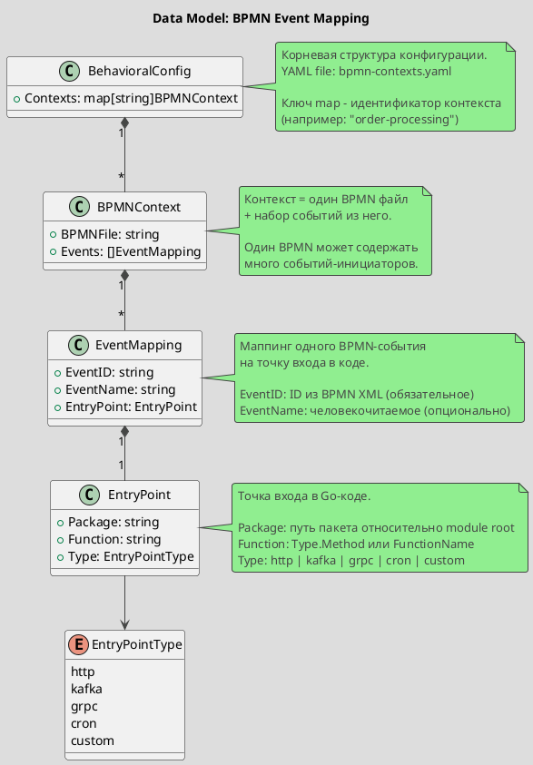

# Spec 0013: Event Mapping Configuration

**Metadata:**
- Priority: 0013 (Medium)
- Status: InProgress
- Created: 2026-02-08
- Effort: S
- Parent Spec: 0011

---

## Overview

### Problem Statement

BPMN-граф бизнес-процессов (spec 0011) содержит события - "Создать заказ", "Получить платеж", "Сгенерировать отчет" и т.д. Чтобы archlint мог связать эти события с кодом, необходимо явно указать точки входа в Go-кодовой базе для каждого события. Автоматическое обнаружение таких связей ненадежно: событие может быть обработано HTTP-хендлером, Kafka-консьюмером, gRPC-сервисом или cron-задачей - формат различается.

Без явной конфигурации маппинга невозможно построить связь "бизнес-процесс -> код" (spec 0012).

### Solution Summary

Ввести отдельный конфигурационный файл `bpmn-contexts.yaml` со структурой `contexts`. Каждый контекст - это один BPMN файл и набор событий из него с маппингом на точки входа в Go-коде. Файл подключается через секцию `behavioral` в `.archlint.yaml`. Loader валидирует формат, проверяет существование event ID в BPMN-файле и (опционально) наличие указанных пакетов/функций в кодовой базе.

### Success Metrics

- Конфигурация парсится без ошибок для валидного YAML
- Невалидный формат дает понятные сообщения об ошибках
- Event ID проверяются на существование в BPMN-файле
- Загруженный маппинг доступен для spec 0012 (call graph builder)

---

## Architecture

### Data Model



---

## Requirements

### R1: Формат конфигурационного файла

**Description:** Отдельный файл `bpmn-contexts.yaml` со структурой `contexts`. Каждый контекст - один BPMN файл и набор событий из него.

```yaml
# bpmn-contexts.yaml
contexts:
  order-processing:
    bpmn_file: processes/order.bpmn
    events:
      - event_id: "StartEvent_CreateOrder"
        event_name: "Create Order"
        entry_point:
          package: "internal/api/handler"
          function: "OrderHandler.Create"
          type: http

      - event_id: "IntermediateCatchEvent_PaymentReceived"
        event_name: "Payment Received"
        entry_point:
          package: "internal/consumer"
          function: "PaymentConsumer.Handle"
          type: kafka

  reporting:
    bpmn_file: processes/reporting.bpmn
    events:
      - event_id: "TimerEvent_GenerateReport"
        entry_point:
          package: "internal/cron"
          function: "ReportJob.Run"
          type: cron

  user-registration:
    bpmn_file: processes/registration.bpmn
    events:
      - event_id: "StartEvent_Register"
        entry_point:
          package: "internal/api/handler"
          function: "UserHandler.Register"
          type: grpc
```

**Обязательные поля:** ключ контекста, `bpmn_file`, `events[].event_id`, `events[].entry_point.package`, `events[].entry_point.function`, `events[].entry_point.type`.
**Опциональные поля:** `events[].event_name`.

### R2: Интеграция с .archlint.yaml

**Description:** Ссылка на файл маппинга из основной конфигурации.

```yaml
# .archlint.yaml (добавить секцию)
behavioral:
  bpmn_contexts: bpmn-contexts.yaml
```

Если секция `behavioral.bpmn_contexts` отсутствует - поведенческий анализ не активируется (graceful skip).

### R3: Configuration Loader

**Description:** Пакет для загрузки и валидации конфигурации маппинга.

**Пакет:** `internal/config` (расширить существующий, если есть) или `pkg/config`.

**Валидация (уровень error - блокирует работу):**
- YAML синтаксис корректен
- Секция `contexts` присутствует и не пуста
- Каждый контекст имеет `bpmn_file` и хотя бы один event в `events`
- Обязательные поля events присутствуют (`event_id`, `entry_point.*`)
- `entry_point.type` содержит допустимое значение
- Нет дубликатов `event_id` внутри одного контекста
- Нет дубликатов ключей контекстов
- Файлы `bpmn_file` существуют

**Валидация (уровень warning - не блокирует):**
- `event_id` существует в соответствующем BPMN XML
- Пакет `entry_point.package` существует в кодовой базе
- Функция `entry_point.function` найдена в указанном пакете
- Дубликат `event_id` между разными контекстами (может быть намеренным)

---

## Acceptance Criteria

- [ ] AC1: Файл `bpmn-contexts.yaml` парсится в структуру `BehavioralConfig`
- [ ] AC2: Контексты доступны по ключу (map[string]BPMNContext)
- [ ] AC3: Отсутствие `bpmn_file` в контексте возвращает ошибку
- [ ] AC4: Пустой `events` в контексте возвращает ошибку
- [ ] AC5: Отсутствие обязательного поля `event_id` возвращает ошибку
- [ ] AC6: Невалидный `entry_point.type` возвращает ошибку с допустимыми значениями
- [ ] AC7: Дубликат `event_id` внутри контекста возвращает ошибку
- [ ] AC8: Несуществующий файл `bpmn_file` возвращает ошибку
- [ ] AC9: Несуществующий `event_id` в BPMN XML возвращает warning
- [ ] AC10: Несуществующий пакет в кодовой базе возвращает warning
- [ ] AC11: Отсутствие секции `behavioral` в `.archlint.yaml` не вызывает ошибку
- [ ] AC12: Несколько контекстов с разными BPMN файлами работают корректно

---

## Implementation Steps

**Step 1:** Определить типы данных
- Files: `internal/config/bpmn_contexts.go`
- Action: Create
- Details: Структуры `BehavioralConfig`, `BPMNContext`, `EventMapping`, `EntryPoint`, тип `EntryPointType`

**Step 2:** Реализовать loader
- Files: `internal/config/bpmn_contexts.go`
- Action: Create
- Details: Функция `LoadBPMNContexts(path string) (*BehavioralConfig, []Warning, error)`. Парсинг YAML, валидация contexts, обязательных полей, дубликатов, допустимых значений type.

**Step 3:** Реализовать валидацию против BPMN
- Files: `internal/config/bpmn_contexts.go`
- Action: Create
- Details: Функция `ValidateAgainstBPMN(ctx *BPMNContext, bpmnProcess *bpmn.BPMNProcess) []Warning`. Проверка что event_id существуют в BPMN-файле. Вызывается для каждого контекста отдельно.

**Step 4:** Интегрировать с .archlint.yaml
- Files: `internal/config/config.go` (существующий)
- Action: Modify
- Details: Добавить поле `Behavioral.BPMNContexts` в корневую конфигурацию. При наличии - загрузить контексты.

**Step 5:** Написать тесты
- Files: `internal/config/bpmn_contexts_test.go`
- Action: Create
- Details: Unit-тесты для всех acceptance criteria

---

## Testing Strategy

### Unit Tests

| Тест | Описание |
|------|----------|
| TestLoadBPMNContexts_Valid | Валидный YAML с несколькими контекстами парсится корректно |
| TestLoadBPMNContexts_MissingEventID | Ошибка при отсутствии event_id в events |
| TestLoadBPMNContexts_InvalidType | Ошибка при невалидном entry_point.type |
| TestLoadBPMNContexts_DuplicateEventID | Ошибка при дубликате event_id внутри одного контекста |
| TestLoadBPMNContexts_MissingBPMNFile | Ошибка при отсутствии bpmn_file в контексте |
| TestLoadBPMNContexts_EmptyEvents | Ошибка при пустом events в контексте |
| TestLoadBPMNContexts_EmptyContexts | Ошибка при пустой секции contexts |
| TestValidateAgainstBPMN_MissingEvent | Warning для несуществующего event_id |
| TestLoadBPMNContexts_AllEntryPointTypes | Все допустимые типы: http, kafka, grpc, cron, custom |
| TestLoadBPMNContexts_MultipleContexts | Несколько контекстов с разными BPMN файлами |

- Coverage target: >= 90%

---

## Notes

### Design Decisions

- **Отдельный файл вместо секции в .archlint.yaml** - `.archlint.yaml` уже 1095 строк, добавление маппингов раздует его. Отдельный файл проще поддерживать и версионировать.
- **Структура `contexts` вместо плоского списка** - BPMN-файлов будет много, каждый контекст самодостаточен: свой BPMN-файл и набор событий. Именованные ключи контекстов дают удобный доступ и группировку.
- **Несколько events в одном контексте** - один BPMN-файл может содержать несколько событий-инициаторов (start event, intermediate catch event, timer event). Каждое маппится на свою точку входа в коде.
- **Warning вместо error для проверки кода** - пакет/функция могут быть еще не реализованы (spec-first подход). Жесткая валидация заблокирует работу на ранних этапах.
- **Поле `type` обязательное** - тип точки входа влияет на то, как spec 0012 строит call graph (HTTP хендлер подключается через router, Kafka consumer - через message handler и т.д.).
- **`event_name` опциональное** - для отчетов удобно иметь человекочитаемое имя, но основной ключ - `event_id` из BPMN XML.

### Code Examples

```go
// internal/config/bpmn_contexts.go

type EntryPointType string

const (
    EntryPointHTTP   EntryPointType = "http"
    EntryPointKafka  EntryPointType = "kafka"
    EntryPointGRPC   EntryPointType = "grpc"
    EntryPointCron   EntryPointType = "cron"
    EntryPointCustom EntryPointType = "custom"
)

type EntryPoint struct {
    Package  string         `yaml:"package"`
    Function string         `yaml:"function"`
    Type     EntryPointType `yaml:"type"`
}

type EventMapping struct {
    EventID    string     `yaml:"event_id"`
    EventName  string     `yaml:"event_name,omitempty"`
    EntryPoint EntryPoint `yaml:"entry_point"`
}

type BPMNContext struct {
    BPMNFile string         `yaml:"bpmn_file"`
    Events   []EventMapping `yaml:"events"`
}

type BehavioralConfig struct {
    Contexts map[string]BPMNContext `yaml:"contexts"`
}

// LoadBPMNContexts загружает и валидирует конфигурацию контекстов.
func LoadBPMNContexts(path string) (*BehavioralConfig, []Warning, error) {
    // ...
}

// ValidateAgainstBPMN проверяет event_id на существование в BPMN-файле.
func ValidateAgainstBPMN(ctx *BPMNContext, bpmnProcess *bpmn.BPMNProcess) []Warning {
    // ...
}
```

### References

- Spec 0011: BPMN Business Process Graph (source of events)
- Spec 0012: Call Graph Builder (consumer of this mapping)
- Spec 0003: Data Model (existing graph model)
