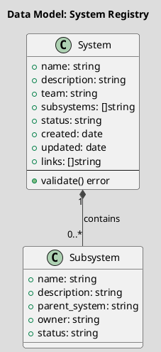

# Spec 0010: Реестр систем и подсистем

**Metadata:**
- Priority: 0010 (High)
- Status: Todo
- Created: 2026-04-20
- Effort: M
- Parent Spec: -
- GitLab Issue: (internal tracker)

---

## Overview

### Problem Statement

В arch-repo отсутствует централизованный реестр систем и подсистем. Архитектурные документы разбросаны по разным teams без единой структуры и метаданных. Это затрудняет:

- Поиск и навигацию по существующим системам
- Понимание зависимостей между subsystems
- Аудит и ревью архитектурных изменений
- Онбординг новых участников

### Solution Summary

Создать реестр систем и подсистем в формате markdown-файлов с YAML frontmatter. Каждая система/подсистема - отдельный файл с единой структурой атрибутов.

### Success Metrics

- Единая структура для всех систем/подсистем
- Быстрый поиск через имена файлов и заголовки
- Визуализация связей через ссылки между файлами
- Возможность автоматической генерации индексов

---

## Architecture

### Data Model



---

## Requirements

### R1: Frontmatter Schema

**Description:** Каждый файл системы/подсистемы должен иметь YAML frontmatter с фиксированным набором полей.

**Fields:**

| Field | Type | Required | Description |
|-------|------|----------|-------------|
| `name` | string | yes | Название системы/подсистемы |
| `description` | string | yes | Описание назначения |
| `team` | string | yes | Команда-владелец (для систем) |
| `subsystems` | []string | no | Список подсистем |
| `owner` | string | no | Owner (для subsystems) |
| `status` | string | yes | `active` / `planned` / `deprecated` |
| `created` | date | yes | Дата создания записи |
| `updated` | date | yes | Дата последнего обновления |
| `links` | []string | no | Ссылки на связанные системы |

**Example Frontmatter:**
```yaml
---
name: "Штрафы и нарушения"
description: "Сервисы для фиксации и расчета штрафов"
team: "violations"
subsystems:
  - "viola-api"
  - "calculation-penalty"
status: active
created: 2025-01-15
updated: 2026-04-20
links:
  - "skladskie-spisaniya"
  - "servisy-rascheta-ko"
---
```

---

### R2: Directory Structure

**Description:** Файлы систем и подсистем хранятся в отдельной директории с логической организацией.

**Structure:**
```
teams-registry/
├── systems/           # Реестр систем (основные бизнес-направления)
│   ├── 01-xxxx.md    # Системы с номерами для порядка
│   └── ...
├── subsystems/        # Реестр подсистем (сервисы внутри систем)
│   ├── 01-xxxx.md
│   └── ...
└── index.md          # Глобальный индекс с навигацией
```

**Naming Convention:**
```
NNNN-short-description.md
```
- `NNNN` = 4-значный ID (0001-9999)
- Меньше число = выше приоритет/стратегичность

---

### R3: Index Generation

**Description:** Автоматическая генерация индексов для навигации.

**Requirements:**
- `index.md` в директории systems/ и subsystems/
- Автоматическое обновление при добавлении файлов
- Таблица с ссылками, описаниями, статусами
- Фильтрация по команде и статусу

---

### R4: Relations Between Systems

**Description:** Возможность указывать связи между системами.

**Relation Types:**
- `depends_on` - система зависит от другой
- `integrates_with` - интеграция в обе стороны
- `supersedes` - заменяет старую систему
- `related` - общие бизнес-процессы

---

## Acceptance Criteria

- [ ] AC1: Создана директория `teams-registry/` с поддиректориями `systems/` и `subsystems/`
- [ ] AC2: Создан файл `teams-registry/systems/index.md` с индексом систем
- [ ] AC3: Создан файл `teams-registry/subsystems/index.md` с индексом подсистем
- [ ] AC4: Создано 5-10 примеров файлов систем (реальные данные)
- [ ] AC5: Frontmatter содержит все обязательные поля из R1
- [ ] AC6: Для каждой системы указан `team` и `status`
- [ ] AC7: Для каждой подсистемы указан `parent_system` и `owner`
- [ ] AC8: Добавлены примеры связей между системами
- [ ] AC9: Индексы содержат таблицы с фильтрацией по статусу
- [ ] AC10: Добавлен README.md с инструкцией по использованию
- [ ] AC11: Внесены изменения в `Teams/README.md` с ссылкой на новый реестр

---

## Implementation Steps

### Phase 1: Foundation

**Step 1.1:** Создать структуру директорий
- Files: `teams-registry/`
- Action: Create
- Details: Создать `systems/`, `subsystems/`, `templates/`

**Step 1.2:** Создать шаблон файла системы
- Files: `teams-registry/templates/system.md`
- Action: Create
- Details: Структура markdown с frontmatter

**Step 1.3:** Создать шаблон файла подсистемы
- Files: `teams-registry/templates/subsystem.md`
- Action: Create
- Details: Структура markdown с frontmatter

---

### Phase 2: Core Content

**Step 2.1:** Создать индекс систем
- Files: `teams-registry/systems/index.md`
- Action: Create
- Details: Таблица с системами по командам

**Step 2.2:** Создать индекс подсистем
- Files: `teams-registry/subsystems/index.md`
- Action: Create
- Details: Таблица с подсистемами

**Step 2.3:** Заполнить реестр реальными системами
- Files: `teams-registry/systems/0001-*.md` (5-10 файлов)
- Action: Create
- Details: Берутся данные из существующих README.md проектов

---

### Phase 3: Documentation

**Step 3.1:** Создать README.md
- Files: `teams-registry/README.md`
- Action: Create
- Details: Инструкция по добавлению/обновлению

**Step 3.2:** Обновить навигацию
- Files: `Teams/README.md`
- Action: Modify
- Details: Добавить ссылку на новый реестр

---

## Testing Strategy

### Verification Steps
- [ ] Проверить структуру директорий
- [ ] Проверить валидность YAML в frontmatter
- [ ] Проверить ссылки между файлами
- [ ] Проверить индексацию таблиц

---

## Notes

### Design Decisions

**Decision:** Использовать markdown с frontmatter вместо JSON/YAML

**Rationale:**
- Читаемость в GitLab merge requests
- Возможность редактирования не-техническими ролями
- Интеграция с существующей документацией
- Комментирование в MR

**Decision:** Отдельные файлы для каждой системы

**Rationale:**
- Меньшие MR (лучше для review)
- История изменений по каждой системе
- Минимизация конфликтов при параллельной работе

### Code Examples

**Validating frontmatter:**
```bash
# Проверка всех файлов на валидность YAML
find teams-registry -name "*.md" -exec sh -c '
  head -n 20 "$1" | grep -A 20 "^---" | yq . > /dev/null 2>&1 || echo "Invalid: $1"
' _ {} \;
```

### References

- Related: Issue #2 (Registry of Services)
- Spec workflow: `~/.claude/rules/spec-workflow.md`
