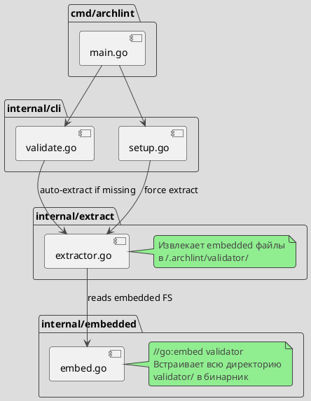
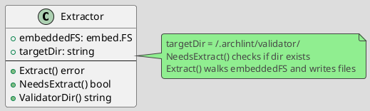
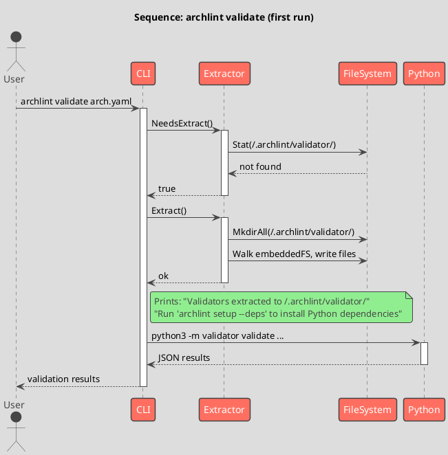

# Spec 0016: go install с embed валидаторов

**Metadata:**
- Priority: 0016 (High)
- Status: Todo
- Created: 2026-03-16
- Effort: M
- Parent Spec: -

---

## Overview

### Problem Statement

archlint нельзя установить одной командой. Сейчас нужно:
1. `git clone` репозитория
2. `make build` или `make install`
3. Валидаторы (Python) остаются в репозитории, бинарник ищет их относительно себя

Это блокирует adoption - пользователь не может просто `go install` и начать работать.

### Solution Summary

Встроить Python-валидаторы в Go-бинарник через `go:embed`. При первом запуске `archlint validate` - автоматически извлечь валидаторы в `~/.archlint/validator/`. Добавить команду `archlint setup` для управления зависимостями.

### Success Metrics

- `go install github.com/mshogin/archlint/cmd/archlint@latest` устанавливает рабочий бинарник
- `archlint validate` работает без клонирования репо (после auto-extract)
- `archlint setup --deps` устанавливает Python-зависимости
- Обратная совместимость: старый способ (из репо) продолжает работать

---

## Architecture

### Component Overview



### Data Model



### Sequence Flow



---

## Requirements

### R1: Embed валидаторов в бинарник

**Description:** Встроить директорию `validator/` в Go-бинарник через `//go:embed`.

**Детали:**
- Создать пакет `internal/embedded/` с `embed.go`
- Embed включает все `.py` файлы из `validator/` рекурсивно
- Исключить `__pycache__`, `.pyc`, тестовые файлы

**Файлы:**
- `internal/embedded/embed.go` - Create

### R2: Extractor - извлечение на диск

**Description:** Модуль извлечения embedded файлов в `~/.archlint/validator/`.

**API:**
```go
package extract

type Extractor struct {
    fs       embed.FS
    rootDir  string // "validator" - prefix in embedded FS
    targetDir string // ~/.archlint/validator/
}

func NewExtractor(fs embed.FS) *Extractor
func (e *Extractor) NeedsExtract() bool
func (e *Extractor) Extract() error
func (e *Extractor) ForceExtract() error
func (e *Extractor) ValidatorDir() string
```

**Детали:**
- `NeedsExtract()` - сравнивает embedded `.version` с `~/.archlint/validator/.version`
- Если версии не совпадают или файла нет -> нужен extract
- `Extract()` - извлекает только если NeedsExtract() == true
- `ForceExtract()` - перезаписывает всегда (для update)
- Сохраняет права файлов (0644 для .py, 0755 для директорий)

**Version Stamp:**
- `validator/.version` генерируется в Makefile через `git describe --tags --always --dirty`
- Embedded в бинарник вместе с валидаторами
- При обновлении бинарника (go install @latest) версия изменится -> auto re-extract

**Файлы:**
- `internal/extract/extractor.go` - Create

### R3: Auto-extract в validate команде

**Description:** При `archlint validate` автоматически извлекать валидаторы если их нет.

**Детали:**
- В `findValidatorDir()` добавить новый путь: `~/.archlint/validator/`
- Приоритет поиска:
  1. Относительно бинарника (../validator/) - для dev из репо
  2. ARCHLINT_VALIDATOR_DIR env
  3. ./validator/ в текущей директории - для dev
  4. ~/.archlint/validator/ - для go install
- Если ни один путь не найден И есть embedded FS -> auto-extract в ~/.archlint/
- После extract - использовать ~/.archlint/validator/

**Файлы:**
- `internal/cli/validate.go` - Modify

### R4: Команда `archlint setup`

**Description:** Команда для управления установкой.

```
archlint setup            # Показать статус установки
archlint setup --deps     # Установить Python зависимости
archlint setup --update   # Переизвлечь валидаторы из бинарника
archlint setup --check    # Проверить что всё работает
```

**Подкоманды:**
- `--deps`: `pip3 install networkx pyyaml numpy scipy`
- `--update`: ForceExtract() embedded валидаторов
- `--check`: проверить python3, зависимости, валидаторы

**Файлы:**
- `internal/cli/setup.go` - Create

### R5: Обратная совместимость

**Description:** Существующие способы установки продолжают работать.

**Детали:**
- `make build` / `make install` - без изменений
- Запуск из клонированного репо - validator/ найдется первым (приоритет 1 и 3)
- ARCHLINT_VALIDATOR_DIR - работает как раньше (приоритет 2)
- go install - новый способ через auto-extract (приоритет 4)

---

## Acceptance Criteria

- [ ] AC1: `internal/embedded/embed.go` содержит `//go:embed` для validator/
- [ ] AC2: `internal/extract/extractor.go` реализует Extract/NeedsExtract/ForceExtract
- [ ] AC3: `go build ./cmd/archlint` включает embedded валидаторы в бинарник
- [ ] AC4: Размер бинарника увеличивается (валидаторы внутри)
- [ ] AC5: `findValidatorDir()` ищет ~/.archlint/validator/ после остальных путей
- [ ] AC6: При отсутствии валидаторов - автоматический extract с сообщением
- [ ] AC7: `archlint setup` показывает статус установки
- [ ] AC8: `archlint setup --deps` устанавливает Python зависимости
- [ ] AC9: `archlint setup --update` переизвлекает валидаторы
- [ ] AC10: `archlint setup --check` проверяет готовность
- [ ] AC11: Запуск из клонированного репо работает как раньше (приоритет ../validator/)
- [ ] AC12: ARCHLINT_VALIDATOR_DIR работает как раньше
- [ ] AC13: Unit тесты для Extractor
- [ ] AC14: `make test` проходит
- [ ] AC15: `golangci-lint` проходит

---

## Implementation Steps

### Phase 1: Embed

**Step 1.1:** Создать `internal/embedded/embed.go`
- `//go:embed` для validator/ директории
- Экспортировать `ValidatorFS embed.FS`

**Step 1.2:** Настроить `.goembedignore` или exclude-паттерны
- Исключить `__pycache__/`, `*.pyc`, `tests/`

### Phase 2: Extractor

**Step 2.1:** Создать `internal/extract/extractor.go`
- Реализовать NewExtractor, NeedsExtract, Extract, ForceExtract, ValidatorDir

**Step 2.2:** Unit тесты для extractor
- Тест extract в temp dir
- Тест NeedsExtract true/false
- Тест ForceExtract перезаписывает

### Phase 3: CLI интеграция

**Step 3.1:** Обновить `internal/cli/validate.go`
- Добавить ~/.archlint/validator/ в findValidatorDir()
- Добавить auto-extract логику

**Step 3.2:** Создать `internal/cli/setup.go`
- Реализовать setup команду с флагами

**Step 3.3:** Обновить `internal/cli/root.go`
- Зарегистрировать setup команду

### Phase 4: Финализация

**Step 4.1:** Обновить Makefile (если нужно)
**Step 4.2:** Запустить тесты и lint
**Step 4.3:** Обновить README с инструкцией `go install`

---

## Testing Strategy

### Unit Tests

- [ ] Test Extractor.NeedsExtract() - dir exists / not exists
- [ ] Test Extractor.Extract() - files created correctly
- [ ] Test Extractor.ForceExtract() - overwrites existing
- [ ] Test Extractor.ValidatorDir() - returns correct path
- Coverage target: 80%+

### Integration Tests

- [ ] Test findValidatorDir() with ~/.archlint/validator/
- [ ] Test auto-extract flow

---

## Notes

### Design Decisions

**go:embed vs альтернативы:**
- go:embed выбран потому что не требует отдельного шага сборки
- Альтернатива (packr, statik) - deprecated или лишняя зависимость
- Альтернатива (Docker) - слишком тяжело для CLI инструмента
- Альтернатива (rewrite in Go) - 220+ валидаторов на Python, переписывание нецелесообразно

**Auto-extract vs extract on install:**
- Auto-extract на первом запуске validate - пользователю не нужно помнить про дополнительный шаг
- Сообщение при extract помогает понять что происходит

**~/.archlint/ как home directory:**
- Стандартный паттерн для CLI инструментов (~/.docker, ~/.kube, ~/.helm)
- Не загрязняет рабочую директорию
- Легко удалить целиком

### Ограничения

- Python3 все еще нужен на машине пользователя
- Python зависимости (networkx, numpy, scipy) нужно установить отдельно через `archlint setup --deps`
- Размер бинарника увеличится (Python файлы ~200-500KB)

### User Flow после `go install`

```bash
# 1. Установить бинарник
go install github.com/mshogin/archlint/cmd/archlint@latest

# 2. Первый запуск - auto-extract + подсказка
archlint validate architecture.yaml
# -> "Validators extracted to ~/.archlint/validator/"
# -> "Run 'archlint setup --deps' to install Python dependencies"
# -> Error: networkx not found

# 3. Установить Python зависимости
archlint setup --deps
# -> pip3 install networkx pyyaml numpy scipy
# -> "Dependencies installed"

# 4. Теперь всё работает
archlint validate architecture.yaml
# -> Итого: 78 проверок, 60 пройдено, 3 ошибок, 15 предупреждений
```
