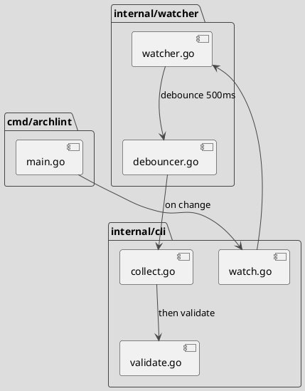
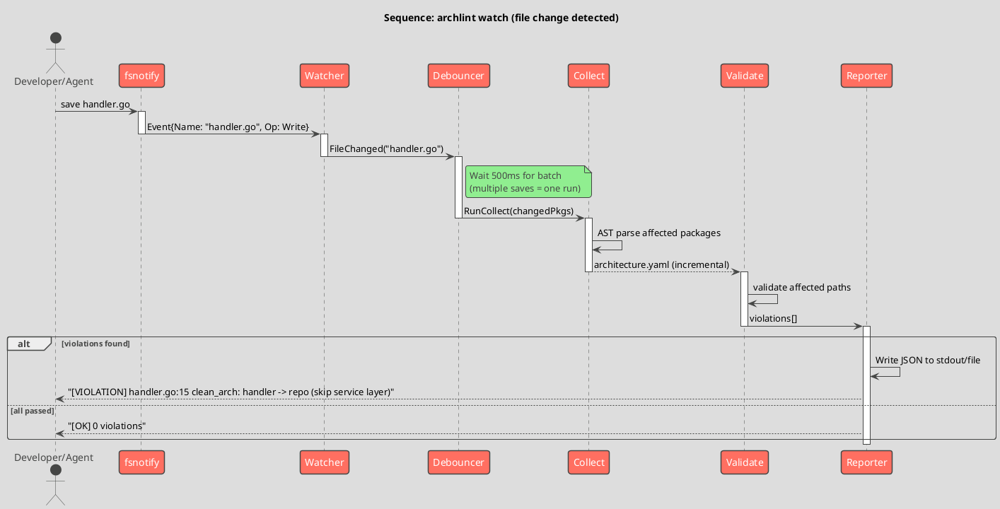

# Spec 0017: archlint watch - background architecture autopilot

**Metadata:**
- Priority: 0017 (High)
- Status: Todo
- Created: 2026-03-28
- Effort: L
- Parent Spec: -
- GitHub Issue: #53

---

## Overview

### Problem Statement

Текущий workflow требует ручных шагов:
1. Написать код (или попросить агента)
2. Вручную запустить `archlint collect`
3. Вручную запустить `archlint validate`
4. Прочитать отчет, создать issues
5. Исправить нарушения

Это замедляет разработку и требует дисциплины. Архитектурные нарушения копятся между запусками.

### Solution Summary

Background worker (`archlint watch`) следит за изменениями .go файлов через fsnotify, автоматически запускает collect -> validate, и выдает машиночитаемый отчет для автоматического исправления агентом.

### Success Metrics

- `archlint watch .` запускается и следит за файлами
- При изменении .go файла -> автоматический collect + validate за <5 сек
- JSON отчет нарушений для машинного потребления
- Daemon mode с PID file и логированием
- Интеграция с Claude Code hook для auto-fix

---

## Architecture

### Component Overview



### Sequence Flow



---

## Requirements

### R1: File Watcher (fsnotify)

**Description:** Следить за изменениями .go файлов в проекте.

**API:**
```go
package watcher

type Watcher struct {
    root       string
    excludes   []string
    onChange   func(changedFiles []string)
    debounceMs int
}

func New(root string, opts ...Option) (*Watcher, error)
func (w *Watcher) Start(ctx context.Context) error
func (w *Watcher) Stop() error
```

**Details:**
- Рекурсивно следить за директориями проекта
- Фильтровать только `.go` файлы (игнорировать `_test.go` опционально)
- Игнорировать: `vendor/`, `.git/`, `node_modules/`, `testdata/`
- Debounce: 500ms после последнего изменения перед запуском

**Files:**
- `internal/watcher/watcher.go` - Create
- `internal/watcher/debouncer.go` - Create

### R2: Incremental Collect + Validate

**Description:** При изменении файла пересобирать и валидировать только затронутые пакеты.

**Details:**
- Определить package по пути измененного файла
- Запустить `collect` для всего проекта (или инкрементально если возможно)
- Запустить `validate` на результате
- Rate limit: максимум 1 запуск в секунду

**Files:**
- `internal/watcher/runner.go` - Create

### R3: CLI команда `archlint watch`

**Description:** Новая CLI команда для запуска watcher.

```
archlint watch [path]              # foreground mode
archlint watch [path] --daemon     # background mode
archlint watch --stop              # stop daemon
archlint watch --status            # check if running
```

**Flags:**
- `--daemon` - запуск в фоне (PID file: `~/.archlint/watch.pid`)
- `--stop` - остановить daemon
- `--status` - проверить статус
- `--log` - путь к лог-файлу (default: `~/.archlint/watch.log`)
- `--format` - формат вывода: `text` (human) или `json` (machine)
- `--exclude` - дополнительные exclude паттерны
- `--fix-cmd` - команда для auto-fix при нарушении (например: `claude --print "fix: {violations}"`)

**Files:**
- `internal/cli/watch.go` - Create

### R4: Machine-readable output

**Description:** JSON вывод для интеграции с агентами.

**Format:**
```json
{
  "timestamp": "2026-03-28T12:00:00Z",
  "trigger": "handler.go",
  "status": "FAILED",
  "duration_ms": 1200,
  "violations": [
    {
      "rule": "clean_arch_layer_skip",
      "severity": "BLOCKING",
      "file": "internal/api/handler.go",
      "line": 15,
      "message": "handler directly calls repository, must go through service layer",
      "suggestion": "Inject service dependency and call service method instead of repo"
    }
  ]
}
```

### R5: Claude Code Hook интеграция

**Description:** Hook для Claude Code - запускает validate после Write/Edit.

**File:** `.claude/hooks/archlint-watch.sh`

```bash
#!/bin/bash
# afterToolUse hook for Write/Edit
FILE="$1"
if [[ "$FILE" == *.go ]]; then
  archlint collect . -o /tmp/arch.yaml 2>/dev/null
  archlint validate /tmp/arch.yaml -f json 2>/dev/null
fi
```

Alternative: `archlint watch` daemon + hook just reads last report.

---

## Acceptance Criteria

- [ ] AC1: `go get github.com/fsnotify/fsnotify` добавлен в go.mod
- [ ] AC2: `internal/watcher/watcher.go` реализует fsnotify watcher
- [ ] AC3: `internal/watcher/debouncer.go` реализует debounce 500ms
- [ ] AC4: `archlint watch .` запускается в foreground и следит за .go файлами
- [ ] AC5: При изменении .go файла -> автоматический collect + validate
- [ ] AC6: Вывод нарушений в stdout (text и json форматы)
- [ ] AC7: `--daemon` режим с PID file и log file
- [ ] AC8: `--stop` останавливает daemon
- [ ] AC9: `--status` показывает состояние
- [ ] AC10: Debounce работает (множественные сохранения = один запуск)
- [ ] AC11: Exclude паттерны работают (vendor/, .git/)
- [ ] AC12: Rate limit (max 1 запуск/сек)
- [ ] AC13: Unit тесты для watcher и debouncer
- [ ] AC14: Integration тест: изменить файл -> получить отчет
- [ ] AC15: `make test` проходит
- [ ] AC16: `golangci-lint` проходит
- [ ] AC17: Claude Code hook скрипт создан и работает

---

## Implementation Steps

### Phase 1: Watcher core (2 дня)

**Step 1.1:** Добавить fsnotify dependency
```bash
cd ~/my/archlint && go get github.com/fsnotify/fsnotify
```

**Step 1.2:** Создать `internal/watcher/watcher.go`
- Рекурсивный directory watch
- Фильтрация .go файлов
- Exclude паттерны

**Step 1.3:** Создать `internal/watcher/debouncer.go`
- Timer-based debounce
- Batch changed files

**Step 1.4:** Unit тесты для watcher и debouncer

### Phase 2: Runner + CLI (1 день)

**Step 2.1:** Создать `internal/watcher/runner.go`
- Интеграция с collect + validate
- Rate limiting
- JSON output

**Step 2.2:** Создать `internal/cli/watch.go`
- Cobra command с флагами
- Foreground mode

**Step 2.3:** Зарегистрировать в root.go

### Phase 3: Daemon mode (1 день)

**Step 3.1:** PID file management
**Step 3.2:** Log file output
**Step 3.3:** --stop, --status subcommands
**Step 3.4:** Signal handling (SIGTERM, SIGINT)

### Phase 4: Claude Code интеграция (0.5 дня)

**Step 4.1:** Claude Code hook скрипт
**Step 4.2:** Тестирование с реальным агентом

### Phase 5: Demo (0.5 дня)

**Step 5.1:** Подготовить демо-репо с "правильной" архитектурой
**Step 5.2:** Подготовить сценарий нарушения для демо
**Step 5.3:** Записать скринкаст (Plan B backup)

---

## Testing Strategy

### Unit Tests

- [ ] Test watcher detects .go file changes
- [ ] Test watcher ignores non-.go files
- [ ] Test watcher excludes vendor/, .git/
- [ ] Test debouncer batches rapid changes
- [ ] Test debouncer fires after timeout
- [ ] Test runner calls collect + validate
- [ ] Test JSON output format
- Coverage target: 80%+

### Integration Tests

- [ ] Test watch -> change file -> get violation report
- [ ] Test daemon start/stop/status
- [ ] Test with real archlint collect + validate

---

## Notes

### Design Decisions

**fsnotify vs polling:**
- fsnotify - event-driven, low CPU usage
- Polling - simpler but wastes CPU
- Decision: fsnotify (standard Go approach)

**Incremental vs full collect:**
- Phase 1: full collect on every change (simple, reliable)
- Future: incremental collect for large projects (optimization)

**Daemon vs hook:**
- Daemon: always running, catches all changes
- Hook: only fires on Claude Code tool calls
- Decision: support both (daemon as primary, hook as lightweight alternative)

### Demo Scenario (Stachka 2026)

```
Terminal 1: archlint watch . --format text
Terminal 2: Agent writes code

1. Agent creates handler that calls repo directly
2. Watch output: "[VIOLATION] clean_arch: handler -> repo (skip service)"
3. Agent fixes: adds service layer
4. Watch output: "[OK] 0 violations"

Total time: ~10 seconds
```
