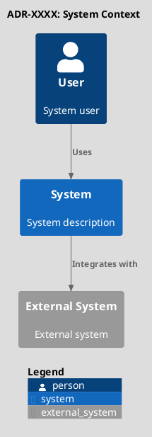
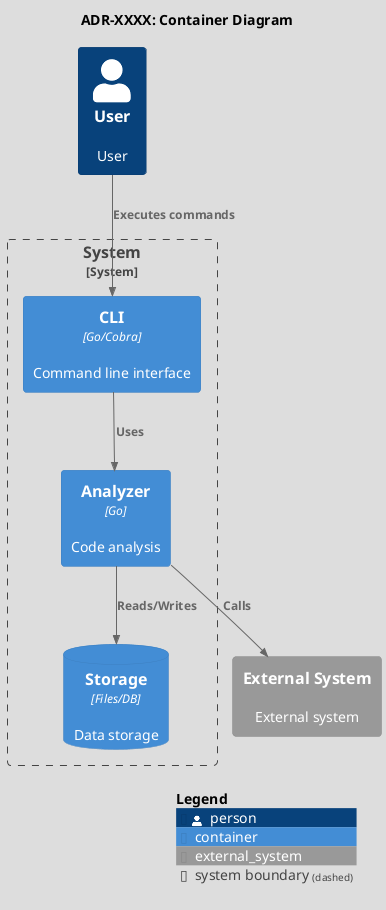
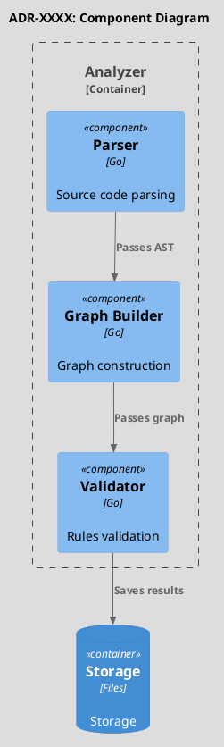
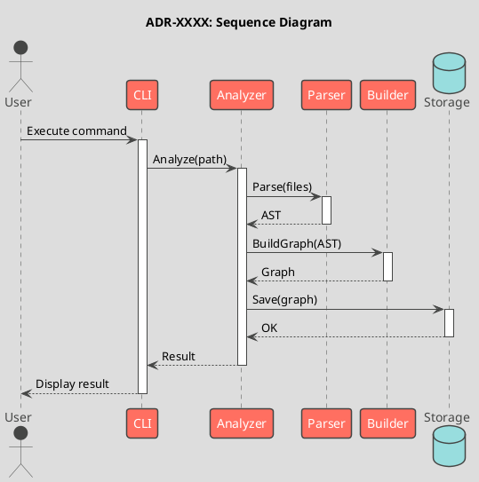

# ADR-XXXX: [Architecture Decision Name]

**EN** | [RU](adr.md)

**Metadata:**
- Status: [Proposed/Accepted/Deprecated/Superseded]
- Date: YYYY-MM-DD
- Deciders: [List of decision makers]
- Related ADRs: [Links to related ADRs]

---

## Context and Problem

[Description of the context in which the decision is being made and the problem that needs to be solved]

### Current Situation
[How it works now]

### Requirements
[Functional and non-functional requirements for the solution]

### Constraints
- [Constraint 1]
- [Constraint 2]

---

## Considered Options

### Option 1: [Name]
**Description:** [Brief description of the approach]

**Pros:**
- [Advantage 1]
- [Advantage 2]

**Cons:**
- [Disadvantage 1]
- [Disadvantage 2]

### Option 2: [Name]
**Description:** [Brief description of the approach]

**Pros:**
- [Advantage 1]
- [Advantage 2]

**Cons:**
- [Disadvantage 1]
- [Disadvantage 2]

### Option 3: [Name]
**Description:** [Brief description of the approach]

**Pros:**
- [Advantage 1]
- [Advantage 2]

**Cons:**
- [Disadvantage 1]
- [Disadvantage 2]

---

## Decision

**Chosen option:** [Name of the selected option]

**Rationale:**
[Why this particular option was chosen]

---

## Solution Architecture

### C4 Context (Level 1: System Context)

### C4 Container (Level 2: Containers)

### C4 Component (Level 3: Components)

### Sequence Diagram (Interaction Sequence)

---

## Consequences

### Positive

- [Positive consequence 1]
- [Positive consequence 2]
- [Positive consequence 3]

### Negative

- [Negative consequence 1]
- [Negative consequence 2]

### Neutral

- [Neutral consequence 1]
- [Neutral consequence 2]

---

## Implementation Details

### Technologies and Libraries
- [Technology 1]: [purpose]
- [Technology 2]: [purpose]

### Changes to Codebase
- [Package/module 1]: [changes]
- [Package/module 2]: [changes]

### Migration Plan
1. [Step 1]
2. [Step 2]
3. [Step 3]

---

## Alternatives (Rejected)

### Why Option 1 Was Not Chosen
[Specific reasons for rejection]

### Why Option 2 Was Not Chosen
[Specific reasons for rejection]

---

## Related Decisions

- [ADR-YYYY]: [name and relationship]
- [ADR-ZZZZ]: [name and relationship]

---

## References

- [Link to documentation 1]
- [Link to issue/PR]
- [Link to external resource]

---

## Example for archlint

**ADR-0001: Choosing an Algorithm for Detecting Circular Dependencies**

Context: Need to detect circular dependencies in the Go package graph

Options:
1. DFS with stack tracking (simple, but only finds simple cycles)
2. Tarjan's algorithm (O(V+E), finds all SCCs)
3. Floyd-Warshall (O(V^3), too slow)

Decision: Chose Tarjan's algorithm
- Optimal complexity O(V+E)
- Finds all strongly connected components in a single pass
- Standard algorithm for this task

Consequences:
+ Efficient detection of all cycles
+ Single pass through the graph
- More complex implementation than DFS
