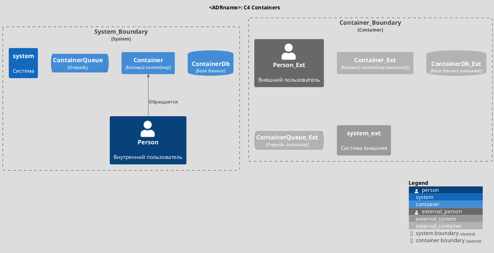
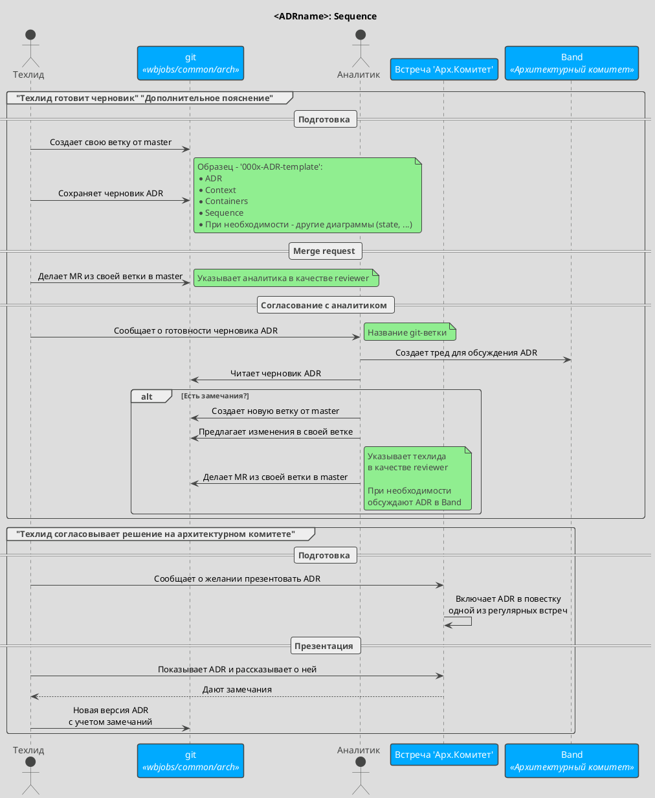

# Название продукта/проекта/фичи

## Проблема 
<описание проблемы>

## Решение
<описание решения>

## Бизнес анализ
### Бизнес процесс
<ссылка на BPMN диаграмму>

### Бизнес требования
<список требований>

### Бизнес правила
<список правил>

## Системный анализ
### Функциональные требования
<списко функциональных требований>

### C4 Контекст
```markdown
@startuml
!theme toy
!include <C4/C4_Context>

title <ADRname>: C4 Context

System_Boundary(arch_system, "Архитектура"){
    Person(analyst, "Аналитик")
    System(arch,"Архитектурный комитет")
    System(git, "Git", "wbjobs/common/arch")
    Lay_D(analyst, git)
    Lay_R(analyst, arch)
}

Person(lead, "Техлид")

Lay_L(lead,arch_system)

Rel(lead,git,"Сохраняет и читает ADR")
Rel(analyst,git,"Сохраняет и читает ADR")
Rel(arch,git,"Валидирует решение")

SHOW_LEGEND()
@enduml
```


### C4 Контейнеры



## Диаграмма последовательности

