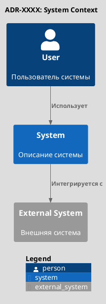
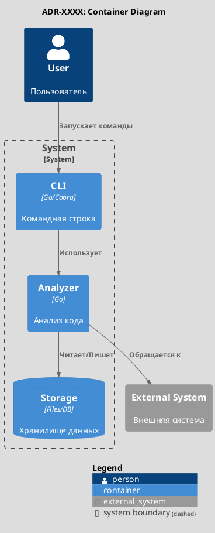
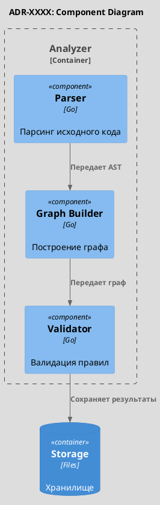
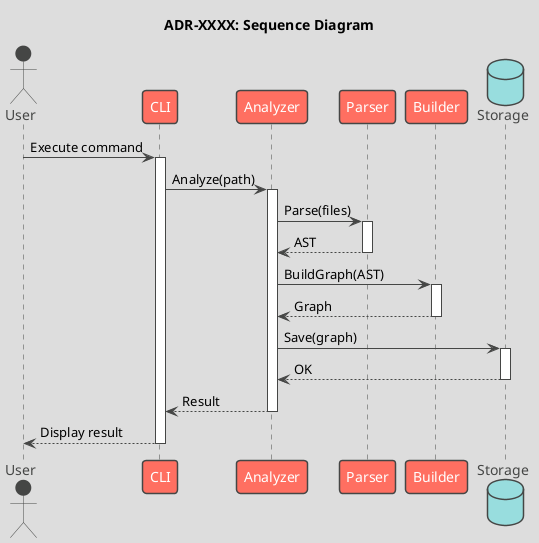

# ADR-XXXX: [Название архитектурного решения]

**Metadata:**
- Status: [Proposed/Accepted/Deprecated/Superseded]
- Date: YYYY-MM-DD
- Deciders: [Список участников принятия решения]
- Related ADRs: [Ссылки на связанные ADR]

---

## Контекст и проблема

[Описание контекста в котором принимается решение и проблемы, которую нужно решить]

### Текущая ситуация
[Как работает сейчас]

### Требования
[Функциональные и нефункциональные требования к решению]

### Ограничения
- [Ограничение 1]
- [Ограничение 2]

---

## Рассматриваемые варианты

### Вариант 1: [Название]
**Описание:** [Краткое описание подхода]

**Плюсы:**
- [Преимущество 1]
- [Преимущество 2]

**Минусы:**
- [Недостаток 1]
- [Недостаток 2]

### Вариант 2: [Название]
**Описание:** [Краткое описание подхода]

**Плюсы:**
- [Преимущество 1]
- [Преимущество 2]

**Минусы:**
- [Недостаток 1]
- [Недостаток 2]

### Вариант 3: [Название]
**Описание:** [Краткое описание подхода]

**Плюсы:**
- [Преимущество 1]
- [Преимущество 2]

**Минусы:**
- [Недостаток 1]
- [Недостаток 2]

---

## Принятое решение

**Выбран вариант:** [Название выбранного варианта]

**Обоснование:**
[Почему был выбран именно этот вариант]

---

## Архитектура решения

### C4 Context (Уровень 1: Системный контекст)

### C4 Container (Уровень 2: Контейнеры)

### C4 Component (Уровень 3: Компоненты)

### Sequence Diagram (Последовательность взаимодействий)

---

## Последствия

### Положительные

- [Положительное последствие 1]
- [Положительное последствие 2]
- [Положительное последствие 3]

### Отрицательные

- [Отрицательное последствие 1]
- [Отрицательное последствие 2]

### Нейтральные

- [Нейтральное последствие 1]
- [Нейтральное последствие 2]

---

## Детали реализации

### Технологии и библиотеки
- [Технология 1]: [назначение]
- [Технология 2]: [назначение]

### Изменения в кодовой базе
- [Пакет/модуль 1]: [изменения]
- [Пакет/модуль 2]: [изменения]

### Миграционный план
1. [Шаг 1]
2. [Шаг 2]
3. [Шаг 3]

---

## Альтернативы (отклоненные)

### Почему не выбран вариант 1
[Конкретные причины отклонения]

### Почему не выбран вариант 2
[Конкретные причины отклонения]

---

## Связанные решения

- [ADR-YYYY]: [название и связь]
- [ADR-ZZZZ]: [название и связь]

---

## Ссылки

- [Ссылка на документацию 1]
- [Ссылка на issue/PR]
- [Ссылка на внешний ресурс]

---

## Пример для archlint

**ADR-0001: Выбор алгоритма для поиска циклических зависимостей**

Контекст: Необходимо обнаруживать циклические зависимости в графе пакетов Go

Варианты:
1. DFS с отслеживанием стека (простой, но только простые циклы)
2. Tarjan's algorithm (O(V+E), находит все SCC)
3. Floyd-Warshall (O(V^3), слишком медленный)

Решение: Выбран Tarjan's algorithm
- Оптимальная сложность O(V+E)
- Находит все strongly connected components за один проход
- Стандартный алгоритм для этой задачи

Последствия:
+ Эффективное обнаружение всех циклов
+ Один проход по графу
- Более сложная реализация чем DFS
