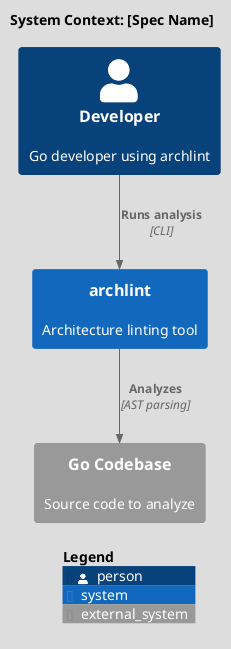
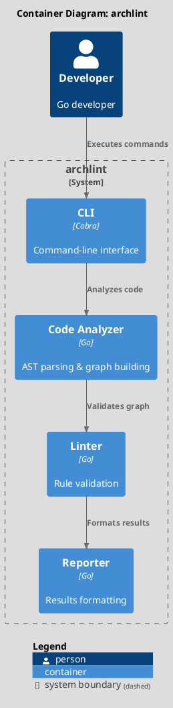
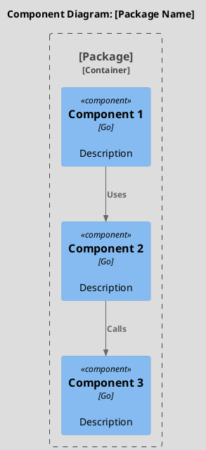
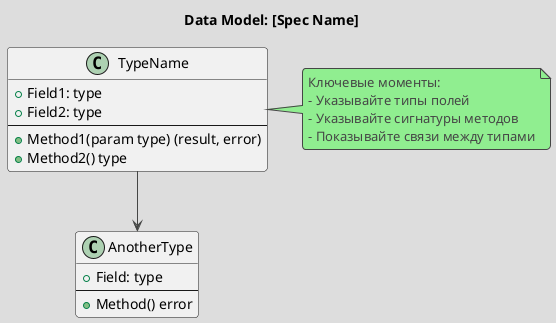
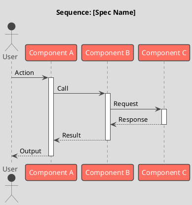
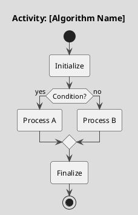

# Spec XXXX: [Spec Title]

[EN](spec-template.en.md) | **RU**

**Metadata:**
- Priority: XXXX (High/Medium/Low)
- Status: Todo
- Created: YYYY-MM-DD
- Effort: XS/S/M/L/XL
- Parent Spec: [Parent spec ID if applicable, or `-`]

---

## Overview

### Problem Statement
[Описание проблемы, которую решает спецификация]

### Solution Summary
[Краткое описание предлагаемого решения]

### Success Metrics
- [Метрика 1]
- [Метрика 2]
- [Метрика 3]

---

## Architecture

<!--
ВАЖНО: Объем диаграмм зависит от размера спецификации:
- XS/S спецификации: только Data Model (UML Class)
- M спецификации: Component + Data Model + Sequence
- L/XL спецификации: все диаграммы (Context, Container, Component, Data Model, Sequence, Activity)
-->

### System Context (C4 Level 1)
<!-- Для L/XL спецификаций: показывает систему в окружении -->
<!-- Для S/M спецификаций: можно пропустить эту секцию -->



---

### Container Diagram (C4 Level 2)
<!-- Для L/XL спецификаций: показывает контейнеры системы -->
<!-- Для S/M спецификаций: можно пропустить эту секцию -->



---

### Component Overview (C4 Component)
<!-- Для M/L/XL спецификаций: показывает компоненты внутри контейнера -->
<!-- Для XS/S спецификаций: можно пропустить или сильно упростить -->



---

### Data Model
<!-- ОБЯЗАТЕЛЬНО для всех спецификаций: показывает структуры данных -->



---

### Sequence Flow (UML Sequence Diagram)
<!-- Для M/L/XL спецификаций: показывает взаимодействия компонентов -->
<!-- Для XS/S спецификаций: можно пропустить или упростить -->



---

### Process Flow (UML Activity Diagram)
<!-- Для L/XL спецификаций: показывает сложные алгоритмы -->
<!-- Для XS/S/M спецификаций: можно пропустить -->



---

## Requirements

<!--
ВАЖНО: Количество и детализация зависят от размера:
- XS/S: 1-3 простых требования
- M: 3-5 требований с некоторыми деталями
- L/XL: 5-11 детальных требований с API, примерами, валидацией
-->

### R1: [Requirement Name]
**Description:** [Описание требования]

<!-- Для L/XL спецификаций добавьте детали: -->
**Input:**
- [Parameter]: [type] - [description]

**Output:**
- [Return value]: [type] - [description]

**API/Methods:**
```go
// Package: [package path]
// File: [file path]

type [TypeName] struct {
    [field] [type]
}

func New[TypeName]([params]) *[TypeName] {
    // Constructor
}

func (t *[TypeName]) [Method]([params]) ([returns], error) {
    // Description
}
```

**Validation Rules:**
- [Rule 1]
- [Rule 2]

---

### R2: [Requirement Name]
[Описание требования]

<!-- Для маленьких спецификаций достаточно краткого описания -->

---

## Acceptance Criteria

<!--
ВАЖНО: Количество критериев зависит от размера:
- XS: 3-5 критериев
- S: 5-10 критериев
- M: 10-15 критериев
- L: 15-25 критериев
- XL: 25-35 критериев

Каждый критерий проверяет ОДНУ конкретную вещь
-->

- [ ] AC1: [Конкретный проверяемый критерий]
- [ ] AC2: [Конкретный проверяемый критерий]
- [ ] AC3: [Конкретный проверяемый критерий]
- [ ] AC4: [Конкретный проверяемый критерий]
- [ ] AC5: All tests pass
- [ ] AC6: Code reviewed

<!-- Для L/XL спецификаций добавьте больше критериев:
- Детальные проверки функциональности
- Edge cases
- Performance requirements
- Error handling
- Integration points
- Backward compatibility
-->

---

## Implementation Steps

<!--
ВАЖНО: Детализация шагов зависит от размера:
- XS/S: 3-5 простых шагов
- M: 5-10 шагов с некоторыми деталями
- L/XL: Разбивка по фазам, 10-20+ детальных шагов
-->

**Step 1:** [Step name]
- Files: [file paths]
- Action: [Create/Modify/Delete]
- Details: [What to do]

**Step 2:** [Step name]
- Files: [file paths]
- Action: [Create/Modify/Delete]
- Details: [What to do]

**Step 3:** Tests
- Files: [test file paths]
- Action: Create
- Details: Write tests

<!-- Для L/XL спецификаций используйте фазы: -->

<!--
### Phase 1: Foundation
**Step 1.1:** ...
**Step 1.2:** ...

### Phase 2: Core Logic
**Step 2.1:** ...
**Step 2.2:** ...

### Phase 3: Integration
**Step 3.1:** ...
**Step 3.2:** ...
-->

---

## Testing Strategy

<!-- Для всех спецификаций: укажите какие тесты нужны -->

### Unit Tests
- [ ] Test [Component A]
- [ ] Test [Component B]
- Coverage target: 80%+

### Integration Tests
<!-- Для M/L/XL спецификаций -->
- [ ] Test [Integration scenario]

---

## Notes

<!--
ВАЖНО: Секция Notes критична для spec driven development:
- Для XS/S: минимальные примеры
- Для M: примеры кода
- Для L/XL: детальные примеры, конфигурации, design decisions
-->

### Design Decisions
<!-- Для M/L/XL спецификаций -->
[Ключевые проектные решения]

### Code Examples

```go
// Пример использования
package example

import "github.com/mshogin/archlint/[package]"

func Example() {
    // Код примера
}
```

### References
- [Ссылка на документацию]
- [Ссылка на related issue]

---

## Примеры спецификаций разного размера

### XS спецификация (50-100 строк): Fix typo in error message

```markdown
# Spec 0099: Fix Error Message Typo

Metadata: Priority: 0099, Status: Todo, Effort: XS

## Overview
Problem: Error message has typo "dependecy" instead of "dependency"
Solution: Fix typo in internal/analyzer/go.go:142

## Architecture
### Data Model
(пропустить для XS)

## Requirements
R1: Fix typo in error message string

## Acceptance Criteria
- [ ] AC1: Typo fixed in go.go:142
- [ ] AC2: Tests pass
- [ ] AC3: No other typos introduced

## Implementation Steps
Step 1: Fix typo in go.go
Step 2: Run tests

## Notes
Location: internal/analyzer/go.go:142
```

---

### S спецификация (100-200 строк): Add new link type

```markdown
# Spec 0080: Add "Implements" Link Type

Metadata: Priority: 0080, Status: Todo, Effort: S

## Overview
Problem: Graph doesn't represent interface implementation relationships
Solution: Add new LinkType "implements" to model

## Architecture
### Data Model
class Link {
  +Type: string  // add "implements" value
}

## Requirements
R1: Add "implements" to LinkType enum
R2: Update validation to accept new type

## Acceptance Criteria
- [ ] AC1: LinkType supports "implements"
- [ ] AC2: Validation accepts "implements"
- [ ] AC3: Example added to tests
- [ ] AC4: Documentation updated
- [ ] AC5: Tests pass

## Implementation Steps
Step 1: Add "implements" to model.go
Step 2: Update validation
Step 3: Add tests

## Notes
Location: internal/model/model.go
```

---

### M спецификация (200-400 строк): Implement graph export to JSON

```markdown
# Spec 0050: Export Graph to JSON

Metadata: Priority: 0050, Status: Todo, Effort: M

## Overview
Problem: archlint only exports to YAML, need JSON for other tools
Solution: Add JSON exporter

## Architecture
### Component Overview
Component(exporter, "JSONExporter", "Go", "Export to JSON")

### Data Model
class JSONExporter {
  +Export(graph Graph) ([]byte, error)
}

### Sequence Flow
User -> CLI: --output json
CLI -> JSONExporter: Export(graph)
JSONExporter --> CLI: JSON bytes

## Requirements
R1: JSONExporter type
- Input: Graph
- Output: []byte, error
- Method: Export(g Graph) ([]byte, error)

R2: CLI integration
- Add --format flag (yaml|json)
- Default: yaml

## Acceptance Criteria
- [ ] AC1: JSONExporter.Export() exists
- [ ] AC2: Exports all graph components
- [ ] AC3: Valid JSON output
- [ ] AC4: CLI --format json works
- [ ] AC5: CLI --format yaml works (backward compat)
- [ ] AC6: Error handling for invalid graphs
- [ ] AC7: Tests cover all node types
- [ ] AC8: Integration test
- [ ] AC9: Documentation updated
- [ ] AC10: golangci-lint passes

## Implementation Steps
Step 1: Create internal/exporter/json.go
Step 2: Implement Export() method
Step 3: Add CLI flag
Step 4: Write tests
Step 5: Update README

## Testing Strategy
### Unit Tests
- Test Export with simple graph
- Test Export with complex graph
- Test error cases

### Integration Tests
- Test full CLI flow

## Notes
JSON format:
{
  "components": {...},
  "links": {...}
}
```

---

### L спецификация (400-700 строк): Implement cycle detection

```markdown
# Spec 0030: Implement Cycle Detection with Tarjan's Algorithm

Metadata: Priority: 0030, Status: Todo, Effort: L

## Overview
Problem: archlint builds graph but doesn't detect circular dependencies
Solution: Implement Tarjan's algorithm for cycle detection

## Architecture
### System Context
(full C4 context diagram)

### Container Diagram
(full C4 container diagram)

### Component Overview
(full C4 component diagram)

### Data Model
(detailed class diagram with all methods)

### Sequence Flow
(detailed sequence diagram)

### Process Flow
(activity diagram for Tarjan's algorithm)

## Requirements
FR1: CycleDetector Type
Input: Graph
Output: [][]string (cycles)
API:
  type CycleDetector struct { graph Graph }
  func NewCycleDetector(g Graph) *CycleDetector
  func (cd *CycleDetector) FindCycles() [][]string
  func (cd *CycleDetector) HasCycle() bool
Complexity: O(V+E)

FR2: Tarjan's Algorithm Implementation
(detailed requirements)

FR3: CLI Integration
(detailed requirements)

NFR1: Performance
- < 1s for 1000 node graph
- O(V+E) complexity

NFR2: Correctness
- Find ALL cycles
- No false positives

## Acceptance Criteria
(25-30 detailed criteria)
- [ ] AC1: File pkg/analyzer/graph/cycles.go exists
- [ ] AC2: CycleDetector type defined
- [ ] AC3: NewCycleDetector constructor
- [ ] AC4: FindCycles() method
...
- [ ] AC25: golangci-lint passes
- [ ] AC26: Test coverage > 90%

## Implementation Steps
### Phase 1: Foundation
Step 1.1: Create cycles.go
Step 1.2: Define CycleDetector type

### Phase 2: Algorithm
Step 2.1: Implement Tarjan's algorithm
Step 2.2: Add helper methods

### Phase 3: Integration
Step 3.1: CLI integration
Step 3.2: Reporter integration

### Phase 4: Testing
Step 4.1: Unit tests
Step 4.2: Integration tests
Step 4.3: Benchmarks

## Testing Strategy
(detailed testing plan)

## Notes
### Design Decisions
Decision: Use Tarjan's algorithm
Rationale: O(V+E), finds all SCC

### Performance Considerations
- Use adjacency list
- Cache results

### Code Examples
(detailed code examples)

### Algorithm Reference
(link to Tarjan's algorithm documentation)
```

---

### XL спецификация (700-1000 строк): Implement configuration system

```markdown
# Spec 0010: Implement Strategy Configuration System with TimeGrid

(Similar to aitrader's 0005-01-strategy-config.md - 968 lines)

Metadata: Priority: 0010, Status: Todo, Effort: XL

## Overview
(detailed problem statement with context)

## Architecture
(all 5 diagrams: Context, Container, Component, 2x Sequence, Activity)

## Requirements
(11 detailed functional requirements with full API specifications)

FR1: Config Interface
FR2: Config Implementation
FR3: TimeGrid System
FR4: Serialization
FR5: CLI Integration
FR6: Validation
FR7: Factory Pattern
FR8: Backward Compatibility
FR9: Migration Strategy
FR10: Performance Optimization
FR11: Error Handling

NFR1: Performance
NFR2: Scalability
NFR3: Maintainability

## Acceptance Criteria
(30-35 criteria covering all aspects)

## Implementation Steps
(20+ steps organized in 4-5 phases)

## Testing Strategy
(comprehensive testing plan with multiple test types)

## Notes
(extensive notes with examples, configurations, formulas, etc.)
```
