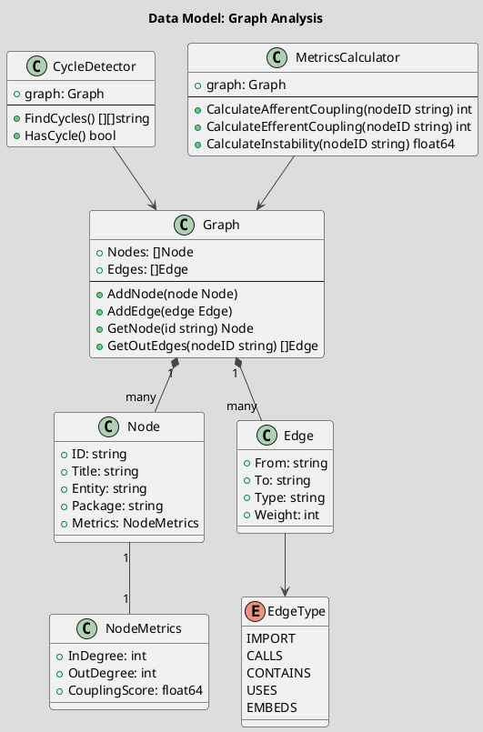
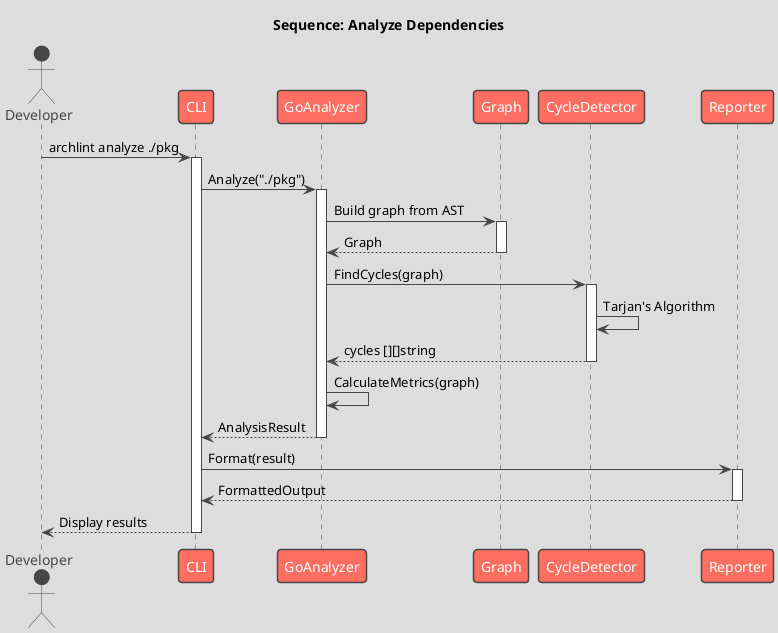
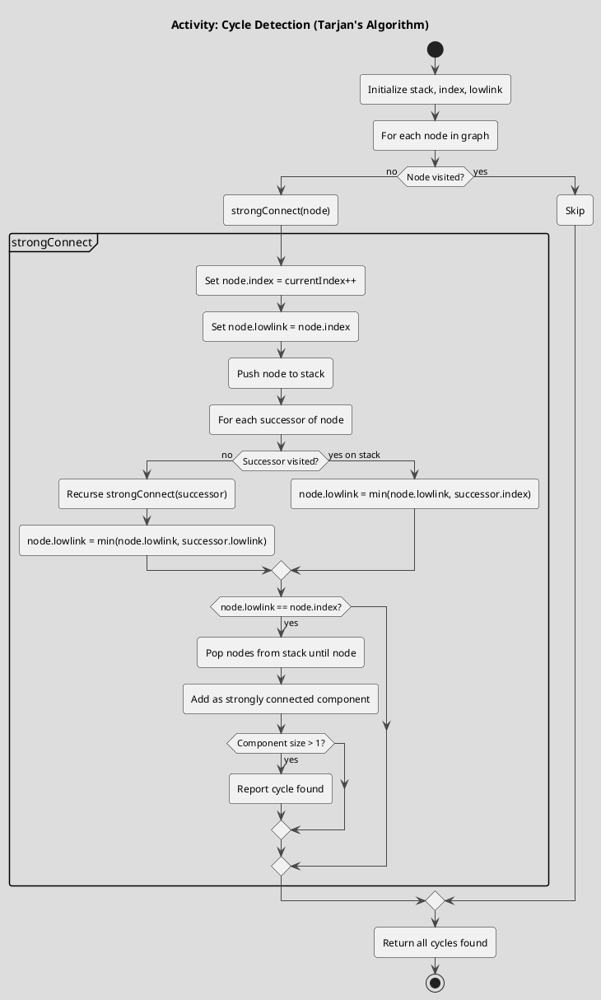

# Spec 0001: Implement Dependency Graph Analyzer

**EN** | [RU](example-spec.md)

**Metadata:**
- Priority: 0001 (High)
- Status: Todo
- Created: 2025-12-07
- Owner: mshogin
- Parent Spec: -
- Estimated Effort: L

---

## Overview

### Problem Statement
The current code analyzer builds a basic dependency graph but doesn't provide tools for analyzing this graph. We need to add functionality for finding cyclic dependencies, analyzing coupling, and calculating complexity metrics.

### Solution Summary
Create a `pkg/analyzer/graph` package with a set of algorithms for dependency graph analysis:
- Cycle detection (Tarjan's algorithm)
- Coupling metrics calculation
- Topological sorting
- Complexity metrics calculation (cyclomatic complexity at graph level)

### Success Metrics
- Detection of all cyclic dependencies
- Analysis time < 1 sec for projects up to 1000 nodes
- Coverage > 85%

---

## Architecture Context (C4 Level 1: System Context)

```plantuml
@startuml spec-0001-context
!include https://raw.githubusercontent.com/plantuml-stdlib/C4-PlantUML/master/C4_Context.puml

title System Context: Dependency Graph Analyzer

Person(developer, "Developer", "Analyzes code architecture")
System(archlint, "Archlint", "Architecture linting tool")
System_Ext(codebase, "Go Codebase", "Source code to analyze")

Rel(developer, archlint, "Runs analysis", "CLI")
Rel(archlint, codebase, "Reads & parses", "AST")

@enduml
```

---

## Architecture Design (C4 Level 2: Container)

```plantuml
@startuml spec-0001-container
!include https://raw.githubusercontent.com/plantuml-stdlib/C4-PlantUML/master/C4_Container.puml

title Container Diagram: Archlint Components

Container(cli, "CLI", "Cobra", "Command-line interface")
Container(analyzer, "Code Analyzer", "Go", "AST parsing & graph building")
Container(graph, "Graph Analyzer", "Go", "Graph algorithms & metrics")
Container(reporter, "Reporter", "Go", "Results formatting")
ContainerDb(cache, "Cache", "Files", "AST cache")

Rel(cli, analyzer, "Analyzes code", "Go API")
Rel(analyzer, graph, "Builds graph", "Go API")
Rel(graph, reporter, "Sends results", "Go API")
Rel(analyzer, cache, "Caches AST", "File I/O")

@enduml
```

---

## Component Design (C4 Level 3: Component)

```plantuml
@startuml spec-0001-component
!include https://raw.githubusercontent.com/plantuml-stdlib/C4-PlantUML/master/C4_Component.puml

title Component Diagram: Graph Analyzer Package

Component(detector, "Cycle Detector", "Go", "Tarjan's algorithm")
Component(metrics, "Metrics Calculator", "Go", "Coupling & complexity")
Component(sorter, "Topological Sorter", "Go", "Dependency ordering")
Component(walker, "Graph Walker", "Go", "DFS/BFS traversal")

Rel(detector, walker, "Uses for traversal")
Rel(metrics, walker, "Uses for traversal")
Rel(sorter, walker, "Uses for traversal")

@enduml
```

---

## Data Model (UML Class Diagram)



---

## Sequence Flow (UML Sequence Diagram)



---

## Process Flow (UML Activity Diagram)



---

## Requirements

### Functional Requirements

**FR1: Cycle Detection**
- Description: Detect all cyclic dependencies in the graph
- Input: Graph
- Output: List of cycles [][]string (each cycle - list of node IDs)
- Dependencies: Graph Walker

**FR2: Coupling Metrics**
- Description: Calculate coupling metrics (afferent/efferent coupling, instability)
- Input: Graph, NodeID
- Output: CouplingMetrics struct
- Dependencies: Graph Walker

**FR3: Topological Sort**
- Description: Order nodes by dependencies
- Input: Graph
- Output: []string (ordered node IDs) or error if cycles exist
- Dependencies: Cycle Detector

### Non-Functional Requirements

**NFR1: Performance**
- Graph analysis with 1000 nodes should take < 1 second
- Memory: O(V + E) where V - nodes, E - edges

**NFR2: Correctness**
- Tarjan's algorithm must find ALL cycles
- Metrics must be mathematically correct

**NFR3: Extensibility**
- Easy to add new analysis algorithms
- Interface-based design for implementation substitution

---

## Acceptance Criteria

### AC1: Cycle Detection Works
- [ ] Detects simple cycles (A->B->A)
- [ ] Detects complex cycles (A->B->C->A)
- [ ] Detects self-loops
- [ ] No false positives on acyclic graphs
- [ ] Works correctly on empty graph

### AC2: Metrics Calculated Correctly
- [ ] Afferent coupling = number of incoming edges
- [ ] Efferent coupling = number of outgoing edges
- [ ] Instability = EC / (AC + EC), range [0, 1]
- [ ] Metrics correct for edge cases (isolated nodes)

### AC3: Performance Requirements Met
- [ ] Graph 100 nodes: < 100ms
- [ ] Graph 1000 nodes: < 1s
- [ ] Graph 10000 nodes: < 10s
- [ ] Benchmarks documented

### AC4: Code Quality
- [ ] Test coverage > 85%
- [ ] All public functions documented
- [ ] golangci-lint passes
- [ ] tracelint passes

---

## Implementation Plan

### Phase 1: Foundation (pkg/analyzer/graph)
**Step 1.1: Create Graph Traversal Utilities**
- Files: `pkg/analyzer/graph/walker.go`
- Action: Create
- Details:
  - Implement DFS (depth-first search)
  - Implement BFS (breadth-first search)
  - Implement visitor pattern for traversal
- Tests: `walker_test.go` - tests on different graphs

**Step 1.2: Create Graph Data Structures**
- Files: `pkg/analyzer/graph/graph.go`
- Action: Create
- Details:
  - Extend existing Graph with new methods
  - GetSuccessors(nodeID) []Node
  - GetPredecessors(nodeID) []Node
  - IsAcyclic() bool
- Tests: `graph_test.go` - basic operations

### Phase 2: Cycle Detection
**Step 2.1: Implement Tarjan's Algorithm**
- Files: `pkg/analyzer/graph/cycles.go`
- Action: Create
- Details:
  - type CycleDetector struct
  - FindStronglyConnectedComponents() [][]string
  - FindCycles() [][]string
  - HasCycle() bool
- Tests: `cycles_test.go` - different cycle types

**Step 2.2: Add Cycle Reporting**
- Files: `pkg/analyzer/graph/report.go`
- Action: Create
- Details:
  - FormatCycle(cycle []string) string
  - Visualize cycles in user-friendly format
- Tests: Check formatting

### Phase 3: Metrics Calculation
**Step 3.1: Implement Coupling Metrics**
- Files: `pkg/analyzer/graph/metrics.go`
- Action: Create
- Details:
  - type MetricsCalculator struct
  - CalculateAfferentCoupling(nodeID string) int
  - CalculateEfferentCoupling(nodeID string) int
  - CalculateInstability(nodeID string) float64
  - CalculateAbstractness(nodeID string) float64
- Tests: `metrics_test.go` - known metrics

**Step 3.2: Add Aggregate Metrics**
- Files: `pkg/analyzer/graph/metrics.go`
- Action: Modify
- Details:
  - CalculateAllMetrics() map[string]NodeMetrics
  - GetMostCoupled(n int) []Node
  - GetMostUnstable(n int) []Node
- Tests: Sorting and aggregation

### Phase 4: Topological Sort
**Step 4.1: Implement Kahn's Algorithm**
- Files: `pkg/analyzer/graph/topo.go`
- Action: Create
- Details:
  - TopologicalSort() ([]string, error)
  - Return error if cycles exist
  - Use queue for BFS-approach
- Tests: `topo_test.go` - DAG and cyclic graphs

### Phase 5: Integration & CLI
**Step 5.1: Add CLI Command**
- Files: `internal/cli/analyze.go`
- Action: Create
- Details:
  - Command: archlint analyze [dir]
  - Flags: --cycles, --metrics, --topo
  - Call graph analyzer
- Tests: Integration test

**Step 5.2: Update Reporter**
- Files: `internal/reporter/graph.go`
- Action: Create
- Details:
  - Format analysis results
  - Output to console, JSON, YAML
- Tests: Format different results

### Phase 6: Documentation & Examples
**Step 6.1: Add Examples**
- Files: `examples/graph_analysis/main.go`
- Action: Create
- Details: API usage examples

**Step 6.2: Update README**
- Files: `README.md`
- Action: Modify
- Details: Document new functionality

---

## Dependencies

### Internal Dependencies
- Existing `internal/analyzer/go.go` - for graph building
- `pkg/model` - for Graph, Node, Edge structures

### External Dependencies
- No new external dependencies
- Using stdlib only

---

## Risks & Mitigations

| Risk | Impact | Probability | Mitigation |
|------|--------|-------------|------------|
| Tarjan's algorithm is complex to implement | High | Medium | Use proven reference implementations, add detailed comments |
| Performance on large graphs | Medium | Low | Early benchmarking, optimize data structures (adjacency list) |
| False positives in cycle detection | High | Low | Thorough testing on real projects, add filtering for allowed cycles |

---

## Testing Strategy

### Unit Tests
- [ ] Test Walker (DFS/BFS) on different graphs
- [ ] Test CycleDetector on graphs with/without cycles
- [ ] Test MetricsCalculator - known values
- [ ] Test TopologicalSort - DAG and cyclic
- Coverage target: 90%+

### Integration Tests
- [ ] Full pipeline: code -> graph -> analysis -> report
- [ ] Test on real project (archlint analyzing itself)
- [ ] Performance benchmarks

### Manual Testing
- [ ] Run on archlint codebase
- [ ] Run on known project with cycles
- [ ] Check CLI output

---

## Files Modified/Created

```
+ pkg/analyzer/graph/walker.go        (new)
+ pkg/analyzer/graph/walker_test.go   (new)
+ pkg/analyzer/graph/cycles.go        (new)
+ pkg/analyzer/graph/cycles_test.go   (new)
+ pkg/analyzer/graph/metrics.go       (new)
+ pkg/analyzer/graph/metrics_test.go  (new)
+ pkg/analyzer/graph/topo.go          (new)
+ pkg/analyzer/graph/topo_test.go     (new)
+ pkg/analyzer/graph/report.go        (new)
~ pkg/analyzer/graph/graph.go         (modified - add helper methods)
+ internal/cli/analyze.go             (new)
+ internal/reporter/graph.go          (new)
+ examples/graph_analysis/main.go     (new)
~ README.md                           (modified - add documentation)
```

---

## Technical Notes

### Design Decisions
- **Tarjan's Algorithm for cycle detection**: O(V+E), finds all SCC in one pass
- **Adjacency List representation**: More efficient for sparse graphs (typical for code dependencies)
- **Interface-based design**: Makes it easy to add new algorithms

### Performance Considerations
- Use map[string][]Edge for adjacency list - O(1) lookup
- Cache metrics if graph doesn't change
- For very large graphs consider streaming analysis

### Security Considerations
- Protection against stack overflow on very deep graphs
- Limit on number of nodes to prevent DoS

### Code Examples

```go
// Example: Finding cycles
package main

import (
    "fmt"
    "github.com/mshogin/archlint/pkg/analyzer/graph"
)

func main() {
    // Build graph from code
    g := graph.NewGraph()
    // ... populate graph ...

    // Detect cycles
    detector := graph.NewCycleDetector(g)
    cycles := detector.FindCycles()

    if len(cycles) > 0 {
        fmt.Printf("Found %d cycles:\n", len(cycles))
        for i, cycle := range cycles {
            fmt.Printf("Cycle %d: %v\n", i+1, cycle)
        }
    }

    // Calculate metrics
    calc := graph.NewMetricsCalculator(g)
    for _, node := range g.Nodes {
        metrics := calc.Calculate(node.ID)
        fmt.Printf("%s: AC=%d, EC=%d, I=%.2f\n",
            node.ID,
            metrics.AfferentCoupling,
            metrics.EfferentCoupling,
            metrics.Instability)
    }
}
```

---

## References

- [Tarjan's Algorithm](https://en.wikipedia.org/wiki/Tarjan%27s_strongly_connected_components_algorithm)
- [Software Package Metrics](https://en.wikipedia.org/wiki/Software_package_metrics)
- [Coupling and Cohesion](https://en.wikipedia.org/wiki/Coupling_(computer_programming))

---

## Progress Log

### 2025-12-07
- Specification created
- Architecture design developed
- Implementation phases defined
