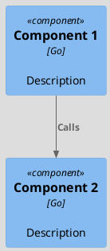
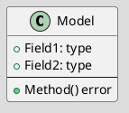
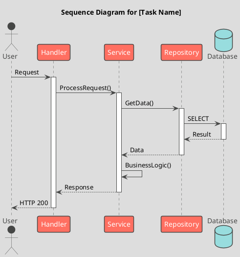
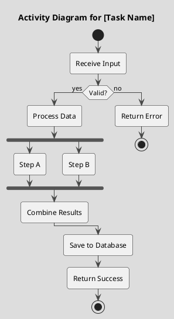

# Task XXX: [Task Title]

**Metadata:**
- Priority: XXX (High/Medium/Low)
- Status: Todo
- Created: YYYY-MM-DD
- Effort: S/M

---

## Обзор

### Problem Statement
[Описание проблемы, которую решает задача]

### Solution Summary
[Краткое описание предлагаемого решения]

### Success Metrics
- [Метрика 1]
- [Метрика 2]

---

## Открытые вопросы
- [Вопрос для обсуждения и принятия решения 1]
- [Вопрос для обсуждения и принятия решения 2]

---

## Architecture

### Component Overview (C4 Component)

### Data Model

### Sequence Flow (UML Sequence Diagram)

### Process Flow (UML Activity Diagram)

---

## Requirements

### R1: [Requirement Name]
- Detail 1
- Detail 2

### R2: [Requirement Name]
- Detail 1
- Detail 2

---

## Acceptance Criteria

- [ ] AC1: [Criterion]
- [ ] AC2: [Criterion]
- [ ] AC3: [Criterion]
- [ ] AC4: All tests pass
- [ ] AC5: Code reviewed

---

## Implementation Steps

**Step 1:** [Step name]
- Action: [What to do]

**Step 2:** [Step name]
- Action: [What to do]

**Step 3:** Tests
- Action: Write unit tests

---

## Testing Strategy

### Unit Tests
- [ ] Test [Component A]
- [ ] Test [Component B]
- Coverage target: 80%+

### Integration Tests
- [ ] Test [Integration scenario 1]
- [ ] Test [Integration scenario 2]

---

## Notes
[Additional notes, links, code snippets]
