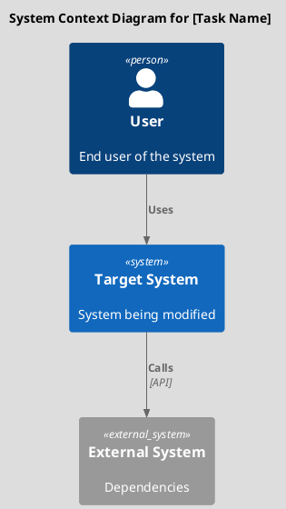
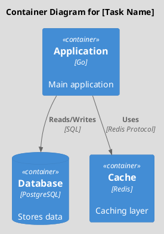
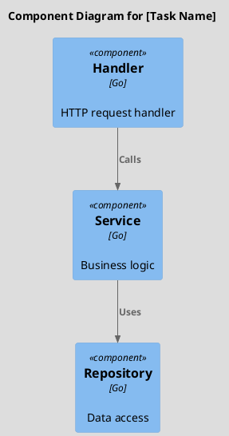
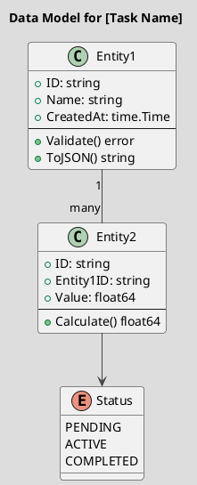
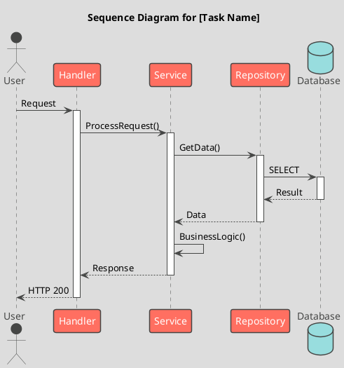
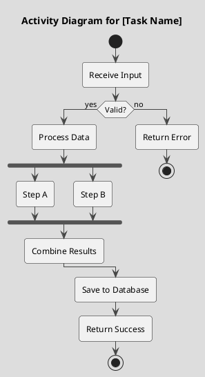

# Task XXX: [Task Title]

**Metadata:**
- Priority: XXX (High/Medium/Low)
- Status: Todo/InProgress/Done
- Created: YYYY-MM-DD
- Owner: [Name]
- Parent Task: [Parent ID if subtask]
- Estimated Effort: [S/M/L/XL]

---

## Overview

### Problem Statement
[Описание проблемы, которую решает задача]

### Solution Summary
[Краткое описание предлагаемого решения]

### Success Metrics
- [Метрика 1]
- [Метрика 2]

---

## Architecture Context (C4 Level 1: System Context)



---

## Architecture Design (C4 Level 2: Containers)



---

## Component Design (C4 Level 3: Component)



---

## Data Model (UML Class Diagram)



---

## Sequence Flow (UML Sequence Diagram)



---

## Process Flow (UML Activity Diagram)



---

## Requirements

### Functional Requirements

**FR1: [Requirement Name]**
- Description: [Detailed description]
- Input: [Expected input]
- Output: [Expected output]
- Dependencies: [Other components/tasks]

**FR2: [Requirement Name]**
- Description: [Detailed description]
- Input: [Expected input]
- Output: [Expected output]
- Dependencies: [Other components/tasks]

### Non-Functional Requirements

**NFR1: Performance**
- [Specific performance criteria]

**NFR2: Security**
- [Security requirements]

**NFR3: Scalability**
- [Scalability requirements]

---

## Acceptance Criteria

### AC1: [Criterion Name]
- [ ] Condition 1
- [ ] Condition 2
- [ ] Condition 3

### AC2: [Criterion Name]
- [ ] Condition 1
- [ ] Condition 2

### AC3: [Criterion Name]
- [ ] Condition 1
- [ ] Condition 2

---

## Implementation Plan

### Phase 1: Foundation
**Step 1.1: [Step Name]**
- Files: `path/to/file.go`
- Action: Create/Modify
- Details: [Implementation details]
- Tests: [Test requirements]

**Step 1.2: [Step Name]**
- Files: `path/to/file.go`
- Action: Create/Modify
- Details: [Implementation details]
- Tests: [Test requirements]

### Phase 2: Core Logic
**Step 2.1: [Step Name]**
- Files: `path/to/file.go`
- Action: Create/Modify
- Details: [Implementation details]
- Tests: [Test requirements]

### Phase 3: Integration & Testing
**Step 3.1: Integration Tests**
- Test scenarios
- Expected behavior

**Step 3.2: Documentation**
- Update README
- Add code comments
- Update API docs

---

## Dependencies

### Internal Dependencies
- Task XXX: [Description]
- Task YYY: [Description]

### External Dependencies
- Package/Library: [Name] ([Version])
- API: [Name] ([Endpoint])

---

## Risks & Mitigations

| Risk | Impact | Probability | Mitigation |
|------|--------|-------------|------------|
| [Risk description] | High/Medium/Low | High/Medium/Low | [Mitigation strategy] |

---

## Testing Strategy

### Unit Tests
- [ ] Test [Component A]
- [ ] Test [Component B]
- Coverage target: 80%+

### Integration Tests
- [ ] Test [Integration scenario 1]
- [ ] Test [Integration scenario 2]

### Manual Testing
- [ ] Test [Scenario 1]
- [ ] Test [Scenario 2]

---

## Technical Notes

### Design Decisions
- [Decision 1]: Rationale
- [Decision 2]: Rationale

### Performance Considerations
- [Consideration 1]
- [Consideration 2]

### Security Considerations
- [Consideration 1]
- [Consideration 2]

### Code Examples

```go
// Example implementation
package example

type Service struct {
    repo Repository
}

func NewService(repo Repository) *Service {
    return &Service{repo: repo}
}

func (s *Service) Process(input string) error {
    // Implementation
    return nil
}
```

---

## References

- [Related Documentation](link)
- [API Documentation](link)
- [Architecture Decision Record](link)

---

## Progress Log

### YYYY-MM-DD
- [Update 1]
- [Update 2]

### YYYY-MM-DD
- [Update 3]
